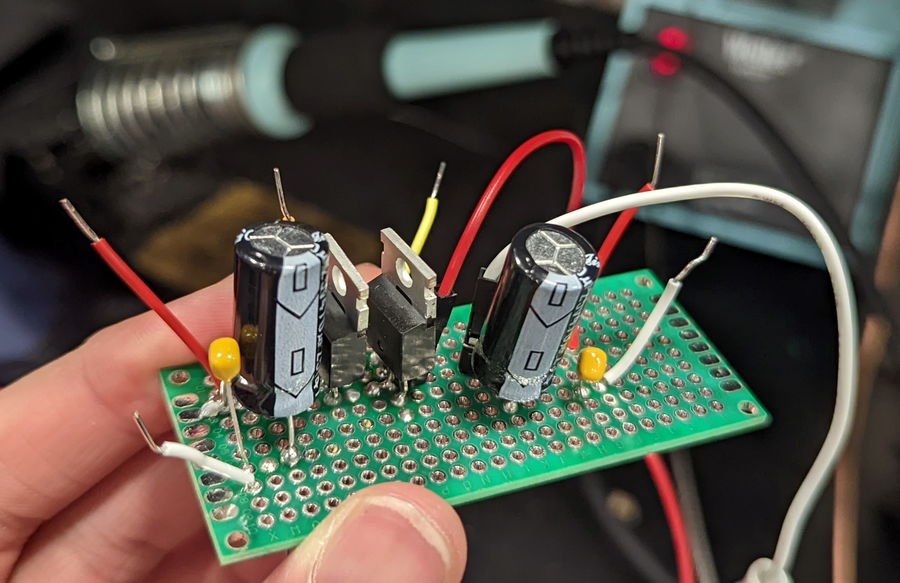

# Kanin's Work Log

## Table of contents:
- [Design Document Check](#designdoccheck)
- [Design Document Complete](#designdocfull)
- [Initial PCB Design](#initialPCB)

# 02/21/2022 - Design Document Check 

Presented in class during that presentation. Talked about our overall design and our verification points within our design document. The main feedback that we got from this session was that we needed to improve our overall detail of our design document. More specifically, we wanted to make sure that we make all of our requirements and verifications as quantitative as much as possible. This meant including different tolerances and calculations. Additionally we needed to make sure that our overall format was presentable and easy to read.

# 02/24/2022 - Completed simulations for Design Document

During this time, I was able to find a research paper that was published regarding the voltage regulation of a MPPT converter when connected to the grid. This paper provides useful insight into the feasibility of our design, essentially verifying that our MPPT must utilize either a buck or a boost converter. The link to the paper can be referenced [here](https://www.sciencedirect.com/science/article/pii/S0378779618304085?via%3Dihub).

Utilized LTSpice to simulate our Buck converter that is being cascaded together with our Buck-Boost converter. During this time, I was able to simulate how the duty cycle affects our overall output ripple voltage. This allows us to essentially control and utilize. 

We can see this simulation result from the images below:

Points to note with these are that we still have significant ringing for our output voltages. What this means for our project is that we must find additional ways to limit our output voltage and make sure that we fall within the bounds of 2% that we set.

# 03/12/2022 - Initial PCB design

During this time, I managed to initiate the first power side PCB. After deliberation during the meeting, we finalized that upon the power side we would need to connect our load directly from our solar cell. With that in mind, we would need to create a separate interleaved buck converter circuit that would allow us to directly. We would also need to use the solar cell to power a separate 7 V input to the MCU as designed by Wonjoon. This involved the use of the chip LM5009 (the datasheet can be referenced [here](../../Resources/LM5009_datasheet.pdf)). This allows us to take a variable input voltage and step that down to exactly 7 V depending upon the ratios of our input resistors. The issues with this is we actually have not created a way to implement the thermal shutdown circuit which protects the chip from being destroyed.

# 03/16/2022 - 03/18/2022 - Reiteration for 7 V operation of our MCU

Some of the issues that came about from the initial PCB design is that the current output of the LM5009 is 150 mA which is not enough current to power our MCU subsystem. As a result, we needed to implement a different solution. During the initial stages, I believed that amplifying our current using a current amplifier. However this would require us to utilize a second voltage source to power the operational amplifier. The topology used can be referenced using [this](https://electronics.stackexchange.com/questions/228148/how-to-design-current-amplifier-circuit-to-amplify-the-signal-current-to-1a).

Without the current amplifier as a viable solution, we needed to quickly pivot away from this idea. The solution that was eventually decided was to utilize a LM2575 adjustable output buck regulator as it is rated for 1 A operation on the output side. During this time we looked at two companies, Microchip and Renesas, and they had options to request for free samples. Ultimately I decided to go with Microchip as they have an option to request for free samples. As a contingency plan, I've also requested free samples from both companies.

# 03/21/2022 - Corrections to the 7 V input to the MCU

During this time, we encountered problems to do with the sourcing of our parts. A lot of manufacturers had large lead times and so we needed to check the ECE supply store for those parts instead. We found that the LM317T was available there and so it made more sense for us to design the schematic based on that. This can be referenced in the image below.

This is the schematic that will be used to change our input voltage to a constant 7 V. According to the datasheet as referenced on [mouser](https://www.mouser.com/datasheet/2/389/cd00000455-1795522.pdf), we can see that the maximum difference that we can have between the input and output voltage is 40 V. Our solar panel is rated at 22 V and so regulating the output to 7 V, in theory, should not be an issue.

# 03/24/2022 - Implementation and part selection for USB charging and buck converter MPPT

After finishing our MCU 7 V output, we needed to create the USB charging as well as the buck converter for MPPT. So I have outlined and created the formulas for calculating the component sizes for this particular buck converter. This can be referenced [here](https://colab.research.google.com/drive/1b9fjIzCAx_Giu6asjYqOtdzP055kivm0?usp=sharing). The code is essentially a plug and chug version for calculating the buck converter output. We're able to choose our input specifications and adjust that accordingly. In terms of creating the USB charging, I utilized some of the information procured by Lukas to create and build that initial schematic.

# 03/26/2022 - Fixing schematic to work with LDO

To ensure that our voltage output is suitable for charging with this LDO, we made sure to simulate this output on LTspice to verify that LDO's are the right way to display those outputs. I've also imported the 5V/2A output LDO into our schematic. From here on out, we should be able to perform some routing to complete this design.

In addition to that, I also implemented a way to help us drive our buck MPPT through utilizing a gate driver. For these purposes, I have chosen to use the LM5109 as way to provide the MOSFETs with a complimentary switching signal. This allows us to drive our buck converter MOSFETs. These can be referenced through the diagram below.

# 03/29/2022 - Finalizing Kicad file

Within this time frame, we were required to submit the PCB for second round orders. This was one of our final opportunities to create a order a PCB through the university. During this time, I was able to create and route the first version of our PCB and send this in to the ECE 445 team.

Highlighted above is the first version of our powerboard that has been submitted to the ECE 445 course staff. After creating the powerboard, I then moved on to creating the bill of materials for the PCB. This was wher ewe encountered an issue with the current board. A lot of the parts such as resistors and capacitors used footprints associated with 0805 and other SMD style footprints. These were either not available on the market or were extremely expensive. As a result, we needed to quickly pivot away from this particular version of the PCB.

# 03/30/2022 - Finalizing version 2 of power board

We had to switch our resistors and capacitor footprints to ceramic capacitors and other through hole resistors. This took some time however ultimately this allowed us to choose and create our bill of materials accurately.

The diagram referenced above is version 2 of our power board with the resistors and capacitor footprints correctly sized. This was eventually ordered through JLC and is expected to arrive the following week.

When creating the bill of materials, we also needed to order all of our parts through digikey.

# 04/11/2022 - Soldering of the power board

Our parts arrived a little faster than anticipated given that we were able to order them on JLC PCB. I have spent these past two days soldering these parts onto our PCB. During the soldering process, we realized that we were also missing some parts. Notably we were missing the connectors as well as the diodes like 1N4002. As a result, we needed to make a second order to reincorporate some of those parts back onto our BOM.

The only components that are left for soldering are the 1N4002's and the phoenix connectors which are coming in later. These are estimated to arrive some time by next week.

# 04/18/2022 - Coming back after covid

After a week pause due to covid, I have finally had a chance to test the PCB. Lukas mentioned earlier in the week that there were problems with the LDO itself. The LDO was not able to step the voltage down to 7 V to power the MCU. During my time in the lab, I managed to figure out that it was largely due to a clearance voltage. The voltage needed to be around 4-5 V higher than 7 for the LDO to consistantly output 7 V. When we ramped up this voltage, we found that the LDO was able to step this down to 8 - 9 V which is suitable for our MCU to operate at.

We then proceeded to test the buck converter. The buck converter itself is problematic as we were not getting the switching output that we wanted. This is largely due to the gate driver IC being very unstable at points. Furthermore there are some inconsistencies with the output voltage of our buck. As a result, this is something in which we have to continue to probe and monitor.

Another issue is that our TPS USB charging unit is not neccesarily working properly. This will something that will need to continue to be probed.

# 04/19/2022 - Debugging the buck converter

It was during this time that I found the issue with the gate driver IC. When double checking the VDD operating point of our operating point of our gate drivers are actually rated for 8 - 14 V. This means that the 5 V output from our MCU will not be able to power the gate drivers themselves. The only way in which we can operate the gate drivers is through rerouting our 7 V LDO. This can be seen from the image shown below. We can see that when we power the powerboard at a voltage above 10 V, that our LDO output outputs 7.8 V to power the MCU board (image referenced below).

With an extra routed connection, we are now able to power the gate drivers by adding an additional jumper wire.

At this point, with our gate drivers working, we used a function generator to simulate our input into our gate drivers. The function generator is able to effectively create a switching PWM signal to power both of our mosfet in our synchronous buck. For the actual demo, we will use our MCU to power this synchronous buck. The default settings that we've used can be seen in the reference image below.

In order to debug our buck converter, we realized that there were potentially issues with the buck converter. One thing that I've realized is that the buck converter actually operates in a non-linear fashion. We can see from the output image below that our buck converter is not able to produce the correct output voltage. Our duty cycle was set at 80%, which means that $V_{out} = DV_{in}$ and thus if our input voltage is 12 V, that would mean that our output voltage would be 9.6 V. 

However when we actually probe the output of our buck converter we see that the output is onlly at 5 V. Therefore I have essentially isolated the problem to the actual operation of the buck converter. This will be something that I will look to debugging tomorrow.

# 04/20/2022 - Building the buck converter on the breadboad

To help isolate the buck converter from the 

# 04/21/2022 - DCM and CCM issue + swapping inductor

DCM and CCM calculations

# 04/22/2022 - Running Simulation for buck converter correction, solving for EMI issues.

https://resources.altium.com/p/create-high-current-buck-voltage-controller 

# 04/23/2022 - Creating own perfboard

In order to continue with the debugging process for our buck converter, we wanted to close our EMI loops as much as possible. Normally this would require us to redo our loops by reprinting our PCB board and redesigning that process on KiCad however given the time constraints, this is no longer a possibility. As a result, we needed to utilize a perfboard to solder our parts on there. This can be referenced from the photo down below.

When we tested the output of this perfboard, we ran into the same issues whereby the buck converter was only able to buck successfully up until 10 V and beyond that the switching duty signal 

# 04/24/2022 Switching our buck converter swithing MOSFETs to diodes + testing functionality with 

# 04/25/2022 Adding USB unit and final system integration
Full integration, check video.

