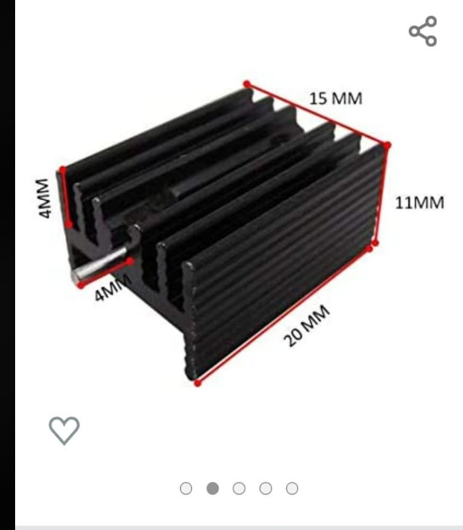
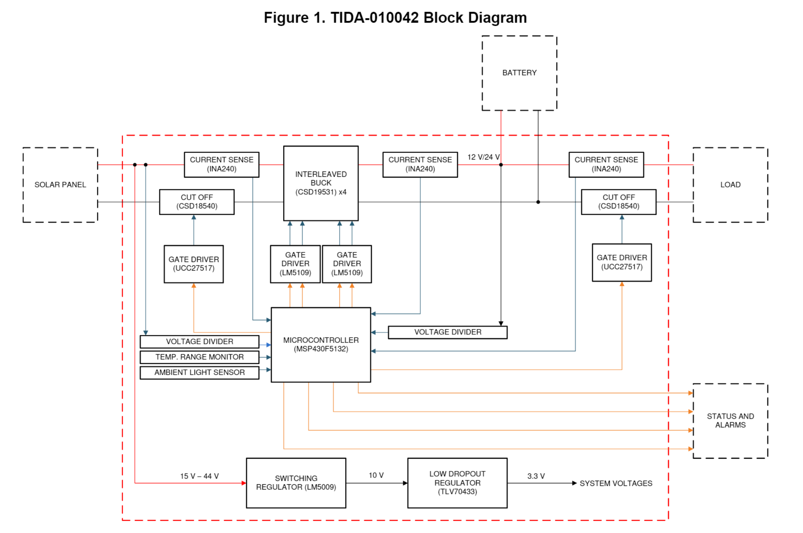
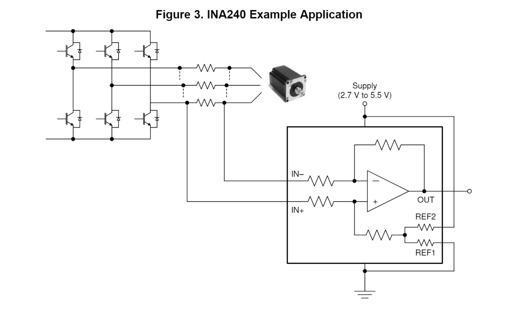
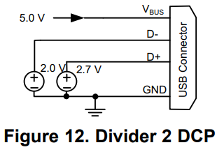

# Lukas' Work Log

## Table of contents:
- [Project Proposal](#projectproposal)
- [Design Document Complete](#designdocfull)
- [Design Document Complete](#designdocfull)

# 01/27/2022 - RFA Approved

## Solution Components:
1. Input: Solar Panel Power Voltage Input (Solar Panels)

    1. Cost effective, efficient, and portable
    2. Commercially available solar panels on digikey are only rated at 1-2 [W], would need to create an array of solar panels to reach 10 [W] on output side
   
2. Synchronous Buck/Boost Converter

    1. Control schema to regulate the power being extracted from the solar panel
    2. Microprocessor creates duty cycle to regulate the intermediate voltage potential in the energy storage unit. The actual energy storage unit will be an off the counter mobile power bank to reduce complexity of a self designed battery.
   
 1. Design of energy transfer process

    1. Need for appropriate voltage regulators to quantify the amount of power received from the solar panel
    2. Current Transducer (CT) and/or regular current sensors can be utilized to monitor that output and the calculations of power consumption will be done on our MCU.
    3. We can store our energy within a small scale power bank (over-the-self portable power bank) that should allow us to keep reserves of the energy.
    4. Stable intermediate voltage potesntial using a custom designed micro controller unit.
3. Secondary DC-DC Converter for several outputs
    1. Use of transformers to provide several different output potential voltages
    2. Analog USB power supply design
   
4. Output: Distribution of different voltage potentials for charging.
    1. Using the rechargeable batteries ordered, we will ensure the output potentials are restricted to the recommended current for charging.

# 01/31/2022 - Researching DC-DC topologies and Battery Safety Precautions 

# 02/03/2022 - Research on MPPT and Cascaded Converters

# 02/6/2022 - Begin Working on Project Proposal

# 02/08/2022 - First TA Meeting 

# 02/13/2022 - Solar Panel Research 

# 02/15/2022 - Purchased ATMEGA328P as the MCU 

# 02/18/2022 - Second TA Meeting 

# 02/20/2022 - Solar Panel Inspection 

# 02/21/2022 - Design Document Check 

# 02/22/2022 - Design Document Submission #1 

# 02/23/2022 - Design Document Submission #1 

# 02/24/2022 - Design Document Submission #1 

# 02/25/2022 - Weekly TA Meeting 

# 02/28/2022 - Heat Sink Considerations 

From prevoious experienec in Power Electronics, the MOSFETs are non-ideal devices with both conduction and switching losses. We are using the [IRLB8721PbF](https://www.infineon.com/dgdl/irlb8721pbf.pdf?fileId=5546d462533600a40153566056732591 "IRLB8721PbF") as the power MOSFETS for our DC-DC converter, which have a maxuimum temperature range of 175 Celsius. We also expect several amps of current to flow through these MOSFETS, where the conduction losses are $P_{cond} = i_{ds}^2 R_{ds}$. The switching losses are due to the finite transtiion times for the MOSFET to change states, which is further discussed [in MOSSFET Losses](https://powerece469.web.illinois.edu/wp/wp-content/uploads/2021/08/70-41484.pdf "in MOSSFET Losses"). With this in mind, we have decided to implement a heat sink in our final project, to ensure that we do not exceed the maximum temperature of the devices whens everal watts of power are coming off of the solar panel. We intend to use a heat sink for all of our voltage regulators and switching converters, due to the high currents that can come from the solar panel. The images from [Renewable Energy Innovation](https://www.re-innovation.co.uk/docs/heatsink-calculations/ "Renewable Energy Innovation") shown below illustrate why a heat sink is needed, because it provides an additional layer of thermal resistance when the device is dissipating heat.

We already have access to heat sinks that can be directly attatached to the back of a through hold MOSFET our LDO voltage regulator. The following image shows the absoluate minimum clearance widths for ourt powr PCB, in order to succesfully attach this to the back of each device. We should do further simulations of how much power we expect the DC=DC converter to dissipate, such that we can reduce the overall volume of the heatsinks. 

# 03/01/2022 - PCB Review 

The PCB review went well for us as a team, there were no major complaints from either of the TAs. We only presented the MCU board, because the MPPT Power PCB will not be finished by the first order deadline on 3/8. Both Yei and I who are responsible for developing the power converter have two midterms this week, and have not had a chance to consistently work on 445. Our goal is to order as many parts as possibel first, and try to finish the second PCB by the end of spring break. The second TA approved of our idea of using a heat sink on the power board, due to the large amount of current we expect to draw from the solar panel. 

# 03/02/2022 - Design Document Review 

The Design Review went alright, but we seem to have presented too much content. We ran out of time to recieve meaningful feedback, but the professor did ask us "What do you plan on doing for curtailment or when there is no load connected to the solar panel?" This was the biggest technical detail that we forgot to include in the Design Document, where we chose to simplify our project by elimintating the need for an energy storage unit. We did not want to design three different PCBs to handle different battery inputs, and believed this to be outside of the scope of what can be accomplisehd within a semester. We did mention a larger charge storage unit in our RFA and our Project Proposal that would handle the curtailment of the soalr panel, but chose to focus our project on MPPT and USB charging. The biggest take away from the design review is that we need to rehearse the final presentation better, give a more breoad overview of each subsystem, and focus on our results rather then each subsystem design. 

# 03/02/2022 - Setting up Overleaf for Final Report 

After we struggled to ensure consistent formatting on the Design Document, we are going to move to Latex for future written assignments. This can be included in the 'textbook cost' of the course, since we must pay $7.99 to share a document with three collaborators. I signed up for the student account subscription, and began organizing a folder stored on the cloud for each team member to access. Here is the link to the shared overleaf document for the [final report](https://www.overleaf.com/project/6212a237c2cf8f5ac891d9d0 "final report").

# 03/04/2022 - Weekly TA Meeting  
The main discussion during this weeks meeting was how the PCB was coming along. Our team had succesfully completed the PCB that hosts the MCU, but we are quite behind on the power board resposnible for MPPT and all of the sensing circuitry (we all have been working on midterms and interviews). Our current plan is to make the encessary changes to the MCu board before the Tuesday deadline, and try to get our second board approved as soon as possible after that. We further discussed how long shipping will take, and if it is more worth it to expedite parts on our own or order additional PCBs before the second order deadline. I believe we will need to order PCBs on our own, if we run into any issues where the PCB ordered does not work. The second item on our agenda are the revisions to the Design Document, because we did not recieve feedback at the end of our Design Review. Akshat did not have any feedback on the technical content, but would ask Profesor Schuh and respond to us tomorrow. 

# 03/05/2022 - Revisions to Design Document   
Yei and I worked on revisign the design document for most of the day. Without written feedback, we tried to ensure the formatting was concise in each section, all pictures were formatted properly, and updated the R&V's to have more detailed verification steps. We further added a section describing the lack of curtailment in the project, due to the limited amount of time to complete our project within one semester. We decided as a team that it would be very complicated to design a power supply that could autonmously switch between the solar panel voltage and an internal voltage supply. We had already begun designing two PCBs, and do not want to overextend our workload. Our system will not be extracting any power from the solar panel during no laod conditions, and the device will shut down if the load battery has fully charged. 

# 03/06/2022 - Found new paper with change of topology  

 In the resource section of this directory, there is a [MPPT Reference Design](https://github.com/kt140/ECE445_SeniorDesign/blob/main/Notebooks/Lukas/Resources/MPPT-Reference-Design.pdf "MPPT Reference Design") that I have been using to understand how the different subcircuits fit together. This docment uses an interleaved buck converter, which uses two duty cycles D1 and D2 that have a certain phase shift between them. This phase shift controls the ripple current through the inductor, where the phase delay between D1 and D2 allow for a smaller current ripple. The block diagram is shown below and each subsystem is very similar to our project, for example, 'Status and Alarms' is the LCD display, 'System Voltages' is how we plan to power the device, and the DC-DC converter is connected directly to the load. 

After looking at the advantages and disadvantages of an inter-leaved buck converter, we should meet up as a team to see if this topology is worth it to develop. The biggest concern I have is the need for 4 different PWM signals for MPPT alone. This is because eachs tage of the interleaved buck converter is its own synchronous buck converter, meaning we must also provide D1, $\bar{D1}$, D2, and  $\bar{D2}$. Reference material for interleaved buck converters can also be found in the Resources directory.

Another great thing about this reference design is the use of the INA240 Current sensor, which is an IC that measures the voltage across a shunt resistor and outputs the current. The location of these sensors on the block diagram is especially important, because we willalso need current sensors at the input and output of the MPPT Dc-DC converter. We currently have simulations and schematics drawn up for a normal buck converter, where these shunt resistors do not dissipate a lot of power. 
The image below shows how this current sensor would be used to measure the DC current output for a three pahse motor. The IC is essential an op amp that amplifies the measured current reading, and also includes enhanced PWM rejection to help eliminate any voltage ripple across the shunt resistor. The INA240 is expensive, but a few locations have them in stock and would be a good alternative to measure the current flowing through our PCB traces for the MPPT feedback algorithm. 

# 03/09/2022 - Completed Transition from GitLab to GitHub  
I have been recording my progress in my own GitLab notebook, which ws shown to our TA during the first TA meeting. Since then, we noticed the course webpage was edited to allow for a GitHub account instead of the GitLab. This entry marks the first time I was successfully able to clone and merge my own repository with my teammates. I am not lsited as a contributor for the project for some reason, but installed GitBash to complete all future Push/Pull requests.

# 03/10/2022 - Team Meeting before spring break       
We met together at the Siebel basement to discuss our schedule for PCB orders. Wonjoon has done the majority of the work for the MCU PCB, but Yei and I have been very indecsive about which topology we want to use. In this meeting, we had Wonjoon give us a full summary of the PCB he designed, while making sure we were explicitly aware of any connectors or signals that needed to be connected to our MPPT Power PCB. This was to ensure that we can correctly route the PWM and feedback signals to the MCU, while separating the power traces from the small signal traces. Furthermore, we had a msicommunication between team members where there are two USB protocols necessary to complete our project. Wonjoon implemented the USB data protocol that allows us to program the MCU, but we have not developed the USB circuitry for 10 W charging. the 10W charging will need to be implemented on the power PCB, to avoid sending a 2 A signal to the MCU board. Currently, Yei and I need to double check the connectors of the Solar Panel in the ECE 445 Lab, finalize the MPPT converter, design an LDO or voltage regualtor for the internal power supply, and formulate how USB charging can be implemented. 

# 03/11/2022 - Finalizing Power Board Schematic with Yei  

After discussing the project with Yei, I realized that we would not be able to meet the Requirements & Verifications (R&V) we wrote in the Design Document without including an energy storage unit. We could not visualize a clear solution for how to simulatnaeouisly extract MPPT and regulate USB charging. It would be unsafe to use an external energy unit ( like a Lithium Ion Battery) to charge a USB device and harness the energy from the solar panel, because we would essentailly be running current directly through the battery and degrading its quality. This requires us to design some circuitry that allows the USB charger to be connected directly to the output of the MPPT DC-DC converter instead of the battery, however, we cannot gaurantee the maximum power point will be found in this sitaution. A PWM solar controller like the 
[SunKeeper](https://www.morningstarcorp.com/products/sunkeeper/ "SunKeeper") provided in lab is commonly used to charge batteries at fixed DC-DC power ratings. Despite eliminating a separate excess energy storage unit from our project, we realized that this was essential to locating the maximum power point. If we do not include this, the MPPT has an upper bound dependent on the USB load, and we may be unsuccesful in compelting the R&Vs outlined in the Design Document. This prohibted us from contiuning on with the power board, until we incorporated some way to store the excess energy with MPPT. 

# 03/12/2022 - TA Meeting and Group Planning 
Due to several of our team members having interviews, we met on the first Saturday of Spring Break for our weekly TA meeting. We mainly discussed how to move forward ordering parts and ordering the PCB on our own. We ran into issues with the cost of our board being $133 for 5 copies, which caused us to miss the first PCB deaadline. Since the 3/8 deadline, we have audited the MCU board and placed an order ourselves to make sure it will arrive in time to test and debug. The biggest concern moving forward is finalizing the power board before the second deadline, and making sure all of our parts can be ordered as soon as possible. 

# 03/18/2022 - Research for USB-A Charging  

I have been using some of my freetime ovre spring break to understand how the USB-A Charging protocol will be implemented. 
At first we all thought that it would be controlled through the MCU, due to standard USB-A protocol also containing birediectional data ports. The following image is from 
["The Basics of USB Battery Charging"](https://www.maximintegrated.com/en/design/technical-documents/tutorials/4/4803.html "THE BASICS OF USB BATTERY CHARGING"), which shows the four input ports for typical USB communication. 

For our project, we do not want to send any data to the USB device connected as a load, which allows us to eliminate the need for both of the data lines D+ and D-. This can be done by connecting the D+ and D- lines together via a resistor. The resistance must be R $\leq 200 \ \Omega$, and this mode is referred to as a Designated Charging Port (DCP). A clear illustration of this is given Figure 10 of the [TPS2514 DATASHEET](https://www.ti.com/lit/ds/symlink/tps2513.pdf?ts=1647718862163&ref_url=https%253A%252F%252Fwww.ti.com%252Fproduct%252FTPS2513 "TPS2514 DATASHEET"). 

This allows the device to bypass the USB communication protocol, and directly connect to the internal battery. We can further ensure that the external USB device is recieving the correct power, by manipulating the voltage potential on either of the D- or D+ lines. The Divider 2 charging scheme is used for
10-W adapters, and applies 2.7 V on the D+ line and 2 V is applied on the D– line, as show below. Fortunately, the TPS2513 is in stock on [Digikey](https://www.digikey.com/en/products/detail/texas-instruments/TPS2513ADBVR/4494483#mktPlaceViewSection "Digikey"), and configures these two lines for us. This drastically simplifies the amount of work required to configure the USB port, where the TPS2513 automatically detects the power requirement of the input usb port. This further matches the simple Female USB connectors available [here](https://www.digikey.com/en/products/detail/sparkfun-electronics/BOB-12700/5762450?utm_adgroup=Adapter%2C%20Breakout%20Boards&utm_source=google&utm_medium=cpc&utm_campaign=Shopping_Product_Prototyping%2C%20Fabrication%20Products&utm_term=&utm_content=Adapter%2C%20Breakout%20Boards&gclid=CjwKCAjw_tWRBhAwEiwALxFPobpQSucNdZ-V3F0eN1F23PQx7BZaxLHDijavc5yAr-V-B6fmEHjo6BoCjKIQAvD_BwE "here").

If this does not work, there is also the option of buying a premade board to do this for us, and simply interface [this board](https://www.seeedstudio.com/Lipo-Rider-Plus-p-4204.html?gclid=CjwKCAjw_tWRBhAwEiwALxFPoR--l6bB3jGPfZKoGkSbGB3EaNlgAs9KFKoq4bSAiMn4nbsBqeK3YBoCO0kQAvD_BwE "this board") with MPPT. 

# 03/25/2022 - TA meeting and Team Meeting  

The first round of parts being ordered were delivered this weke, but we have not recieved our MCU board to begin assembly and testing. This board is scheduled to arrive over the weekend, right before the second PCB order deadline. The focus of the TA meeting (3:45 PM) was to ensure we were designing our PCBs according to course standards, similar to the material covered during the PCB design review. With the second deadline being shortly after spring break, and our team being behind for several personal reasons, we talked about each aspect of the power PCB board that were not finalized. This included, the placement of current sensors, discussion of replacement parts, clearance for heat sinks, and USB charging safety. Although we have schematics for these designed in the KiCad schematic editor, we have not been able to simulate the MPPT fucntionality, which made us fall behind in the PCB routing and external connections. 

After a few hours of independent work, we also had a team meeting at 8 PM to discuss what each team member could focus on. Wonjoon would focus on the MCU code and assembly of the MCU board once it is delivered, whereas Yei and I will do all we can to make sure the power board PCB will not have to be ordered a second time. We further discussed the lack of components in stock on major carriers like digikey, suggesting to use breakout baords for safe USB charging and UART conversion. This is the easiest way for us to proceed in the project, without having extra safety concerns when testing. 