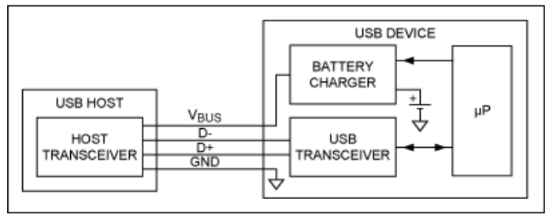
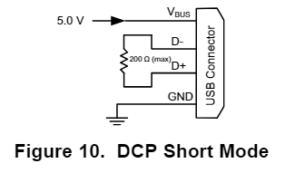
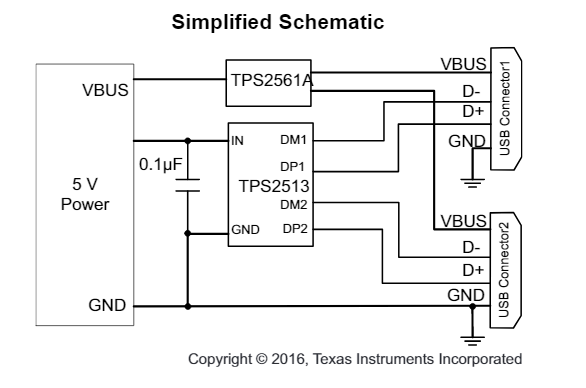

# Lukas' Work Log

## Table of contents:
- [Project Proposal](#projectproposal)
- [Design Document Complete](#designdocfull)
- [Design Document Complete](#designdocfull)

# 01/27/2022 - RFA Approved

## Solution Components:
1. Input: Solar Panel Power Voltage Input (Solar Panels)

    1. Cost effective, efficient, and portable
    2. Commercially available solar panels on digikey are only rated at 1-2 [W], would need to create an array of solar panels to reach 10 [W] on output side
   
2. Synchronous Buck/Boost Converter

    1. Control schema to regulate the power being extracted from the solar panel
    2. Microprocessor creates duty cycle to regulate the intermediate voltage potential in the energy storage unit. The actual energy storage unit will be an off the counter mobile power bank to reduce complexity of a self designed battery.
   
 1. Design of energy transfer process

    1. Need for appropriate voltage regulators to quantify the amount of power received from the solar panel
    2. Current Transducer (CT) and/or regular current sensors can be utilized to monitor that output and the calculations of power consumption will be done on our MCU.
    3. We can store our energy within a small scale power bank (over-the-self portable power bank) that should allow us to keep reserves of the energy.
    4. Stable intermediate voltage potesntial using a custom designed micro controller unit.
3. Secondary DC-DC Converter for several outputs
    1. Use of transformers to provide several different output potential voltages
    2. Analog USB power supply design
   
4. Output: Distribution of different voltage potentials for charging.
    1. Using the rechargeable batteries ordered, we will ensure the output potentials are restricted to the recommended current for charging.

# 01/31/2022 - Researching DC-DC topologies and Battery Safety Precautions 

# 02/03/2022 - Research on MPPT and Cascaded Converters

# 02/6/2022 - Begin Working on Project Proposal

# 02/08/2022 - First TA Meeting 

# 02/13/2022 - Solar Panel Research 

# 02/15/2022 - Purchased ATMEGA328P as the MCU 

# 02/18/2022 - Second TA Meeting 

# 02/20/2022 - Solar Panel Inspection 

# 02/21/2022 - Design Document Check 

# 02/22/2022 - Design Document Submission #1 

# 02/23/2022 - Design Document Submission #1 

# 02/24/2022 - Design Document Submission #1 

# 02/25/2022 - Weekly TA Meeting 

# 02/28/2022 - Heat Sink Considerations 

# 03/01/2022 - PCB Review 

# 03/02/2022 - Design Document Review 

# 03/02/2022 - Setting up Overleaf for Final Report 

# 03/04/2022 - Weekly TA Meeting  

# 03/05/2022 - Revisions to Design Document   

# 03/06/2022 - Found new paper with change of topology  

# 03/09/2022 - Completed Transition from GitLab to GitHub  

# 03/10/2022 - Finaalizing Power Board Schematic with Yei (Siebel) 

# 03/11/2022 - Finaalizing Power Board Schematic with Yei  

# 03/12/2022 - TA Meeting and Group Planning 

# 03/18/2022 - Research for USB-A Charging  

I have been using some of my freetime ovre spring break to understand how the USB-A Charging protocol will be implemented. 
At first we all thought that it would be controlled through the MCU, due to standard USB-A protocol also containing birediectional data ports. The following image is from 
["The Basics of USB Battery Charging"](https://www.maximintegrated.com/en/design/technical-documents/tutorials/4/4803.html "THE BASICS OF USB BATTERY CHARGING"), which shows the four input ports for typical USB communication. 

For our project, we do not want to send any data to the USB device connected as a load, which allows us to eliminate the need for both of the data lines D+ and D-. This can be done by connecting the D+ and D- lines together via a resistor. The resistance must be R $\leq 200 \ \Omega$, and this mode is referred to as a Designated Charging Port (DCP). A clear illustration of this is given Figure 10 of the [TPS2514 DATASHEET](https://www.ti.com/lit/ds/symlink/tps2513.pdf?ts=1647718862163&ref_url=https%253A%252F%252Fwww.ti.com%252Fproduct%252FTPS2513 "TPS2514 DATASHEET"). 

This allows the device to bypass the USB communication protocol, and directly connect to the internal battery. We can further ensure that the external USB device is recieving the correct power, by manipulating the voltage potential on either of the D- or D+ lines. The Divider 2 charging scheme is used for
10-W adapters, and applies 2.7 V on the D+ line and 2 V is applied on the D– line, as show below. Fortunately, the TPS2513 is in stock on [Digikey](https://www.digikey.com/en/products/detail/texas-instruments/TPS2513ADBVR/4494483#mktPlaceViewSection "Digikey"), and configures these two lines for us. This drastically simplifies the amount of work required to configure the USB port, where the TPS2513 automatically detects the power requirement of the input usb port. This further matches the simple Female USB connectors available [here](https://www.digikey.com/en/products/detail/sparkfun-electronics/BOB-12700/5762450?utm_adgroup=Adapter%2C%20Breakout%20Boards&utm_source=google&utm_medium=cpc&utm_campaign=Shopping_Product_Prototyping%2C%20Fabrication%20Products&utm_term=&utm_content=Adapter%2C%20Breakout%20Boards&gclid=CjwKCAjw_tWRBhAwEiwALxFPobpQSucNdZ-V3F0eN1F23PQx7BZaxLHDijavc5yAr-V-B6fmEHjo6BoCjKIQAvD_BwE "here").

Text

If this does not work, there is also the option of buying a premade board to do this for us, and simply interface [this board](https://www.seeedstudio.com/Lipo-Rider-Plus-p-4204.html?gclid=CjwKCAjw_tWRBhAwEiwALxFPoR--l6bB3jGPfZKoGkSbGB3EaNlgAs9KFKoq4bSAiMn4nbsBqeK3YBoCO0kQAvD_BwE "this board") with MPPT. 