# Lukas' Work Log

## Table of contents:
- [RFA](#Original-Solution-Ideas)
- [Project Proposal](#projectproposal)
- [Design Document Complete](#designdocfull)
- [Design Document Complete](#designdocfull)

# 01/27/2022 - RFA Approved

## Solution Components:
1. Input: Solar Panel Power Voltage Input (Solar Panels)

    1. Cost effective, efficient, and portable
    2. Commercially available solar panels on digikey are only rated at 1-2 [W], would need to create an array of solar panels to reach 10 [W] on output side
   
2. Synchronous Buck/Boost Converter

    1. Control schema to regulate the power being extracted from the solar panel
    2. Microprocessor creates duty cycle to regulate the intermediate voltage potential in the energy storage unit. The actual energy storage unit will be an off the counter mobile power bank to reduce complexity of a self designed battery.
   
 1. Design of energy transfer process

    1. Need for appropriate voltage regulators to quantify the amount of power received from the solar panel
    2. Current Transducer (CT) and/or regular current sensors can be utilized to monitor that output and the calculations of power consumption will be done on our MCU.
    3. We can store our energy within a small scale power bank (over-the-self portable power bank) that should allow us to keep reserves of the energy.
    4. Stable intermediate voltage potesntial using a custom designed micro controller unit.
3. Secondary DC-DC Converter for several outputs
    1. Use of transformers to provide several different output potential voltages
    2. Analog USB power supply design
   
4. Output: Distribution of different voltage potentials for charging.
    1. Using the rechargeable batteries ordered, we will ensure the output potentials are restricted to the recommended current for charging.

# 01/31/2022 - Researching DC-DC topologies and Battery Safety Precautions 
The current implementation I suggested is the Forward or flyback Converter, which uses a three winding transformer to deliver power from the primary winding to the secondary output windings. A picture of the converter can be seen below, wehre the transformer provides galvanic isolatioon between the input and output. This would be ideal to use in our project, because it clearly separates the USB 5V/2A from the NiCd 1.6V/70mA. A downside of this approach is that the solar panel input has a direct path to the output, where MPPT may deliver more power then the load can handle. Furthermore, the closed loop control loop with feedback would have to monitor all three windings of the transformer, which would increase the complexity of the software implementation. 

My idea outlined in the RFA includes several batteries that must store some charge. A consumer product needs to regulate a battery to store excess energy, as well as the USB charging protocol and NiCd batteries. The course policy on battery safety has been reviewd by each of my team members, and the associated signature agreement is located in this GitHub. We plan on limiting the total current, implementing fault protection, and reverse polarity detection on each battery, to ensure there is no safety concerns or misconduct according to IEEE guidelines. 

# 02/03/2022 - Research on MPPT 

I have looked into several different algorithms that can be used to obtain the maximum power point. The ones we will be able to implement are Peturb and Observe, Incremental Conduction, or Ripple Correlation. Ripple correlation is used for DC-AC applications, where as the other two can be used to power a DC DC converter. Peturb and Observe operates by making small changes to the duty cycle, and oberserving the change in output power. If the change in the duty cycle caused more power to be consumed, the duty cycle is incremented, otherwise it is decremented. What is convenient about this algorithm is that we can measure the current through the inductor in a closed loop feedback. The last algorithm we can use is the Incremental Conduction Algorithm, which is similar to Peturb and Obsevre, but involves computing the $\frac{dI}{dV}=0$, in order to ensure we converge to the maximum power point. It is more computationally expensive then the Peturb and Observe with slower convergence, but it minimizes unwanted oscillations at the output. Hence, picking the appropriate algorithm is a tradeoff beteween simplicity versus accuracy. 

https://www.hindawi.com/journals/ijp/2016/1728398/

# 02/6/2022 - Begin Working on Project Proposal

After looking at the rubric for the Project Proposal, I began working on an outline of different subsystems and the tolerance analysis. The primary focus was doing simulations of a Forward conevrter, which can be found in the directory "Not uploaded lol." Thee LTSpice simulations shows a normal forward converter where the user must enter the specifgied input voltage and the target duty cycle. After assigning values to the capacitors, switches, and transformer, I was able to acieve a working topology that delivers the correct amopunt of pweor to both of the output terminals. One downside I noticed is that the two output voltages are coupled together,  meaning any peturbation in the duty cycle affects both voltages. If we were to apply a closed loop control algorithm, where we measure the current and adjust the duty cycle, we would not be able to individually control either output. This is a large problem with our current design, and is further addressed in the Tolerance Analysis. 

This problem can be solved by modifying the MPPT algorithm to supply the maximum allowed power, by setting an upper bound on the output solar panel current. This upper bound restricts the current on the primary winding of our transformer, which is mathematically represented as 𝐼 . Thus, if we can place an upper bound in by $I_1N_1 + I_2N_2 + I_3N_3 = 0$
programming the microcontroller, then there will also be an upper bound on the sum of the output currents on $I_1$, and the total output current $I_2 + I_3$ does not exceed any ratings. Furthermore, in the no load conditions when $I_2 = 0$ and $I_3 = 0$, we can focus on providing a path for the current 𝐼 to the charge storage unit. This is the strength of using a three winding transformer in $I_1$ our design, but we must also be prepared to account for additional losses, such as the magnetizing inductance of the system.

# 02/08/2022 - First TA Meeting 

The first TA meeting was mainly to demonstrate that our notebooks, were all in one repository on GitLab. The project has several circuits, such as Li-Ion battery charging, that we have not had experience designing. We further discussed the need for software in the project, where we must select an appropritate MCU. After speakign with Professor Schuh, he reccomended that we use an ATMEGA328P, rather then an entire Arduino Uno. This works well for us, since I have expereince with the Arduino IDE. We then set our weekly meeting time to 2 PM on Fridays. 

# 02/13/2022 - Solar Panel Research 
One thing that is still ambiguous for our project, is how we will test our device using a photovoltaic power source. The cost of solar panels is larger then our budget, where we cannot afford a compact solar array with a maximum output of 15-20 W. One idea I discussed with Kanin is using the solar panel attatched to a single bench in the lab, rather then pluggin our device directly into the terminals. This is how we both worked with solar panels in the Power Lab, but the solar panel in the Senior Design Lab is cluttered with old projects. We do not feel comfortable disassembling wires from teams that have not cleaned up after themselves. I emailed Professor Schuh for his suggestion on the best course of action, but he has not emailed me back. 

# 02/15/2022 - Purchased ATMEGA328P as the MCU 
Today, I went to the ECE Supply shop and bought an ATMEGA329P MCU before they went out of stock. Many microcontrollers are not available online due to the supply shortage, so I paid the cost out of pocket to secure the part in our design. The next step is figuring out how we will program the MCU while it is assembled on the final version. 

# 02/18/2022 - Second TA Meeting 
After we were able to put more thought into each subsystem of the project, such as the current and voltage regulation, input power manmagement, etc., the main task was to finish securing the details of each circuit. We have several deadlines in the course, including the soldering assignment and our DDC, so we discussed each of our responsibilities for the following week. I began writing the Design document while looking over the power electronics needed, Wonjoon would help designing the circuits needed to interface with the MCU, and Kanin would help simulate and design the power converter. 

# 02/20/2022 - Solar Panel Inspection 
Today, I visited the lab to verify the solar panel we had access to. I needed to look at the rated power and standard operating conditions of the solar panel, such that we could finalize the input specifications to our DC DC converter. This can be seen in the image below, where all of the key parameters are listed. We should further note that we will not be able to dissipate 100 W of power, thus we have to include some kind of large energy storage unit or limit the amount of power we can harness from the solar panel. The latter is the better option, where we can simply cover a fraction of the solar panel with some anti reflective coating or shade. We do not expect to dissipate over 20 W of power in our project, which would allows us to eliminate $\frac{4}{5}$ of the solar cells  ( $P_{max}/5  = 20 \ W$ ). Further research needs to be done on the solar panels data shee, in order to know exactly what area needs to be shaded. One tradeoff of this method is that we will no longer be able to use the parameters listed in the image below, because they are meant to describe the entire solar array. We will have to do furhter testing with the solar panel, to redefine $V_{OC}$, $I_{SC}$, and $P_{MAX}$ with 1/5 of the solar array. The second image shows a detail image of the solar panels connectors, which we need to find the appropriate electrical connection for. 

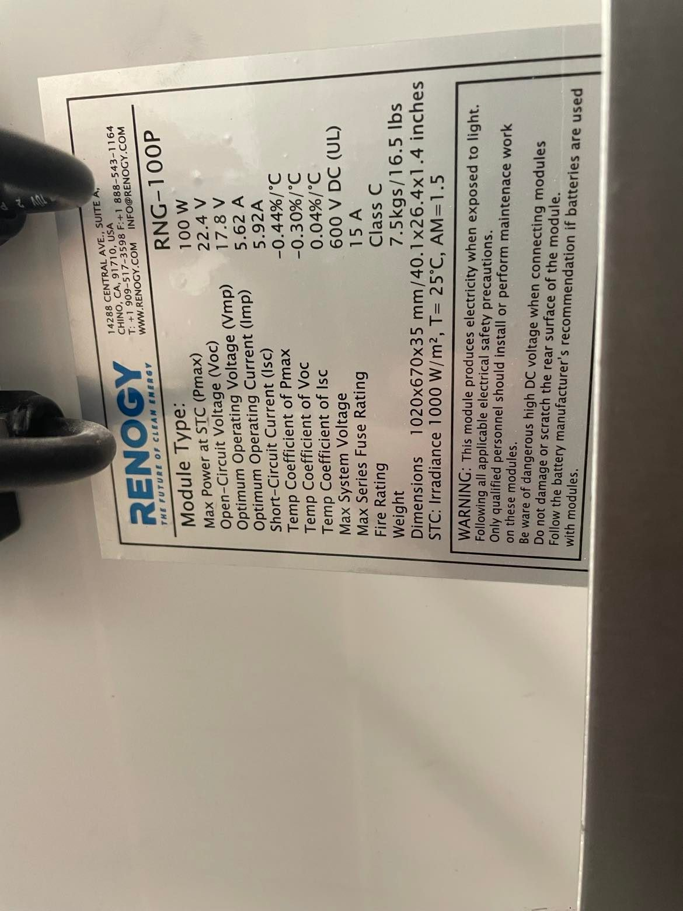

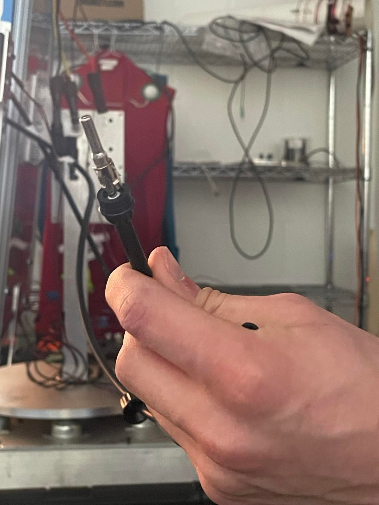

# 02/21/2022 - Design Document Check 
The design document went well today, which allowed us to receive good feedback about our Tolerance Analysis. Originally, we mentioned some of the challenges we might run into using different DC DC converter topologies. The DC DC power subsytem is the centerpiece of our project, but we have been struggling to develop it in detail because we do not have access to the necessary software, such as MATLAB and SIMULINK packages. We further were naive and expected to buiy a small solar array that could be incorporated into the final consumer design, but solar panels are quite expensive during the supply shortage. We would need to spend $80 to reach 16 W of power. Although we proposed possible solutions and research in different algorithms, we were told that we should work through the math of a criticial subsytem, and that simply putting the equations was not enough. Kanin and I then began simulating a Buck and a Buck Boost, the main two choices we were consdiering in our design topology, in LTSPice, using the corner points of the Renogy Solar Panel. We used a python script to simulate different duty cycles, where the cascaded DC DC converter could reliable create a 5-7 V Power Signal. 

We have also decided to change the DC DC converter used in our project. We have been looking at doing a cascaded converter, instead of a Flyback converter, because we need to regulate both the input and output voltages. Our idea is that we can use the MPPT algorithm to extract the maximum power from the solar panel, and then have a second DC-DC converter in series. The secondary DC-DC converter would have a control algorithm wrapped around it, which restricts the output to 5V regardless of the input. The two most common converters used are a Buck-Boost or a Boost-Buck, which both can be characterized by the formula $V_{out} = \frac{DV_{in}}{1-D}$. This 

# 02/22/2022 - Design Document Submission #1 
I began working on a design document in latex and in google docs. Thwe google docs was meant to be a quick place where we could collaborate ideas, and then the final edited versions can be transferred to Latex. Today I was able to write the Introduction and part of the MPPT subsytem and related circuits. Furthermore, I began to sketch an image for the conceptual design of the project. I will add that image here once I am finished. 

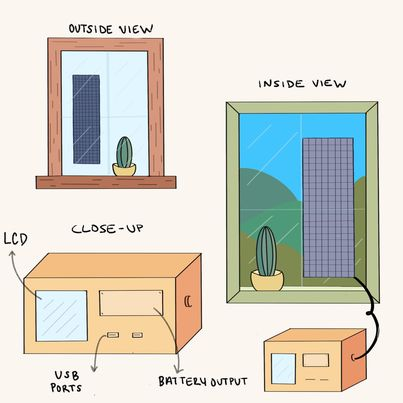

# 02/23/2022 - Design Document Submission #1 

Continued working on the design document as a team. There were several moving parts to each subsytem, and we mainly worked together to understand how each piece fit together. This further allowed us to share all of the resdults we had found, making sure everyone was up to date on the project. One thing that is a point of problem, is that we are still unable to simulate our MPPT algorithm and do not have time to develop robust code in c/c++ to test any algorithms ourselves. We have mainly been loking at research papers, [like this one](https://github.com/kt140/ECE445_SeniorDesign/blob/main/Notebooks/Lukas/Resources/MPPT-and-optimal-Li-ion.pdf "like this one").

# 02/25/2022 - Weekly TA Meeting 

During this weeks TA meeting, we discussed how much progress we have made before the PCB Check next week. Our group has made significant headway on the MCU and NiCD Battery charging subsystems, in part thanks to Wonjoon developing the MCU PCB. For my side of things, I am very behind designing the power board PCB, because we have not finished selecting the parts, such as current sensors, gate drivers, and control ICs. Many of the most suitbale parts are not in stock do to the supply and manufacturing shortage, so we have been scouring the internet that have different ICs to do unit tasks within our design. Once these components have been selected and more simulation has been done to compute the maximum current and voltages through our pwoer electronics, we can begin routing the PCB. We will be able to turn a PCB for the PCB Review, but we will not have our entire project designed and implemented. This is also in part due to exams in my other classes, on top of writing assignments for this course. 

# 02/28/2022 - Heat Sink Considerations 

From prevoious experienec in Power Electronics, the MOSFETs are non-ideal devices with both conduction and switching losses. We are using the [IRLB8721PbF](https://www.infineon.com/dgdl/irlb8721pbf.pdf?fileId=5546d462533600a40153566056732591 "IRLB8721PbF") as the power MOSFETS for our DC-DC converter, which have a maxuimum temperature range of 175 Celsius. We also expect several amps of current to flow through these MOSFETS, where the conduction losses are $P_{cond} = i_{ds}^2 R_{ds}$. The switching losses are due to the finite transtiion times for the MOSFET to change states, which is further discussed [in MOSSFET Losses](https://powerece469.web.illinois.edu/wp/wp-content/uploads/2021/08/70-41484.pdf "in MOSSFET Losses"). With this in mind, we have decided to implement a heat sink in our final project, to ensure that we do not exceed the maximum temperature of the devices whens everal watts of power are coming off of the solar panel. We intend to use a heat sink for all of our voltage regulators and switching converters, due to the high currents that can come from the solar panel. The images from [Renewable Energy Innovation](https://www.re-innovation.co.uk/docs/heatsink-calculations/ "Renewable Energy Innovation") shown below illustrate why a heat sink is needed, because it provides an additional layer of thermal resistance when the device is dissipating heat.

We already have access to heat sinks that can be directly attatached to the back of a through hold MOSFET our LDO voltage regulator. The following image shows the absoluate minimum clearance widths for ourt powr PCB, in order to succesfully attach this to the back of each device. We should do further simulations of how much power we expect the DC=DC converter to dissipate, such that we can reduce the overall volume of the heatsinks. 

# 03/01/2022 - PCB Review 

The PCB review went well for us as a team, there were no major complaints from either of the TAs. We only presented the MCU board, because the MPPT Power PCB will not be finished by the first order deadline on 3/8. Both Yei and I who are responsible for developing the power converter have two midterms this week, and have not had a chance to consistently work on 445. Our goal is to order as many parts as possibel first, and try to finish the second PCB by the end of spring break. The second TA approved of our idea of using a heat sink on the power board, due to the large amount of current we expect to draw from the solar panel. 

# 03/02/2022 - Design Document Review 

The Design Review went alright, but we seem to have presented too much content. We ran out of time to recieve meaningful feedback, but the professor did ask us "What do you plan on doing for curtailment or when there is no load connected to the solar panel?" This was the biggest technical detail that we forgot to include in the Design Document, where we chose to simplify our project by elimintating the need for an energy storage unit. We did not want to design three different PCBs to handle different battery inputs, and believed this to be outside of the scope of what can be accomplisehd within a semester. We did mention a larger charge storage unit in our RFA and our Project Proposal that would handle the curtailment of the soalr panel, but chose to focus our project on MPPT and USB charging. The biggest take away from the design review is that we need to rehearse the final presentation better, give a more breoad overview of each subsystem, and focus on our results rather then each subsystem design. 

# 03/02/2022 - Setting up Overleaf for Final Report 

After we struggled to ensure consistent formatting on the Design Document, we are going to move to Latex for future written assignments. This can be included in the 'textbook cost' of the course, since we must pay $7.99 to share a document with three collaborators. I signed up for the student account subscription, and began organizing a folder stored on the cloud for each team member to access. Here is the link to the shared overleaf document for the [final report](https://www.overleaf.com/project/6212a237c2cf8f5ac891d9d0 "final report").

# 03/04/2022 - Weekly TA Meeting  
The main discussion during this weeks meeting was how the PCB was coming along. Our team had succesfully completed the PCB that hosts the MCU, but we are quite behind on the power board resposnible for MPPT and all of the sensing circuitry (we all have been working on midterms and interviews). Our current plan is to make the encessary changes to the MCu board before the Tuesday deadline, and try to get our second board approved as soon as possible after that. We further discussed how long shipping will take, and if it is more worth it to expedite parts on our own or order additional PCBs before the second order deadline. I believe we will need to order PCBs on our own, if we run into any issues where the PCB ordered does not work. The second item on our agenda are the revisions to the Design Document, because we did not recieve feedback at the end of our Design Review. Akshat did not have any feedback on the technical content, but would ask Profesor Schuh and respond to us tomorrow. 

# 03/05/2022 - Revisions to Design Document   
Yei and I worked on revisign the design document for most of the day. Without written feedback, we tried to ensure the formatting was concise in each section, all pictures were formatted properly, and updated the R&V's to have more detailed verification steps. We further added a section describing the lack of curtailment in the project, due to the limited amount of time to complete our project within one semester. We decided as a team that it would be very complicated to design a power supply that could autonmously switch between the solar panel voltage and an internal voltage supply. We had already begun designing two PCBs, and do not want to overextend our workload. Our system will not be extracting any power from the solar panel during no laod conditions, and the device will shut down if the load battery has fully charged. 

# 03/06/2022 - Found new paper with change of topology  

 In the resource section of this directory, there is a [MPPT Reference Design](https://github.com/kt140/ECE445_SeniorDesign/blob/main/Notebooks/Lukas/Resources/MPPT-Reference-Design.pdf "MPPT Reference Design") that I have been using to understand how the different subcircuits fit together. This docment uses an interleaved buck converter, which uses two duty cycles D1 and D2 that have a certain phase shift between them. This phase shift controls the ripple current through the inductor, where the phase delay between D1 and D2 allow for a smaller current ripple. The block diagram is shown below and each subsystem is very similar to our project, for example, 'Status and Alarms' is the LCD display, 'System Voltages' is how we plan to power the device, and the DC-DC converter is connected directly to the load. 

After looking at the advantages and disadvantages of an inter-leaved buck converter, we should meet up as a team to see if this topology is worth it to develop. The biggest concern I have is the need for 4 different PWM signals for MPPT alone. This is because eachs tage of the interleaved buck converter is its own synchronous buck converter, meaning we must also provide D1, $\bar{D1}$, D2, and  $\bar{D2}$. Reference material for interleaved buck converters can also be found in the Resources directory.

Another great thing about this reference design is the use of the INA240 Current sensor, which is an IC that measures the voltage across a shunt resistor and outputs the current. The location of these sensors on the block diagram is especially important, because we willalso need current sensors at the input and output of the MPPT Dc-DC converter. We currently have simulations and schematics drawn up for a normal buck converter, where these shunt resistors do not dissipate a lot of power. 
The image below shows how this current sensor would be used to measure the DC current output for a three pahse motor. The IC is essential an op amp that amplifies the measured current reading, and also includes enhanced PWM rejection to help eliminate any voltage ripple across the shunt resistor. The INA240 is expensive, but a few locations have them in stock and would be a good alternative to measure the current flowing through our PCB traces for the MPPT feedback algorithm. 

# 03/09/2022 - Completed Transition from GitLab to GitHub  
I have been recording my progress in my own GitLab notebook, which ws shown to our TA during the first TA meeting. Since then, we noticed the course webpage was edited to allow for a GitHub account instead of the GitLab. This entry marks the first time I was successfully able to clone and merge my own repository with my teammates. I am not lsited as a contributor for the project for some reason, but installed GitBash to complete all future Push/Pull requests.

# 03/10/2022 - Team Meeting before spring break       
We met together at the Siebel basement to discuss our schedule for PCB orders. Wonjoon has done the majority of the work for the MCU PCB, but Yei and I have been very indecsive about which topology we want to use. In this meeting, we had Wonjoon give us a full summary of the PCB he designed, while making sure we were explicitly aware of any connectors or signals that needed to be connected to our MPPT Power PCB. This was to ensure that we can correctly route the PWM and feedback signals to the MCU, while separating the power traces from the small signal traces. Furthermore, we had a msicommunication between team members where there are two USB protocols necessary to complete our project. Wonjoon implemented the USB data protocol that allows us to program the MCU, but we have not developed the USB circuitry for 10 W charging. the 10W charging will need to be implemented on the power PCB, to avoid sending a 2 A signal to the MCU board. Currently, Yei and I need to double check the connectors of the Solar Panel in the ECE 445 Lab, finalize the MPPT converter, design an LDO or voltage regualtor for the internal power supply, and formulate how USB charging can be implemented. 

# 03/11/2022 - Finalizing Power Board Schematic with Yei  

After discussing the project with Yei, I realized that we would not be able to meet the Requirements & Verifications (R&V) we wrote in the Design Document without including an energy storage unit. We could not visualize a clear solution for how to simulatnaeouisly extract MPPT and regulate USB charging. It would be unsafe to use an external energy unit ( like a Lithium Ion Battery) to charge a USB device and harness the energy from the solar panel, because we would essentailly be running current directly through the battery and degrading its quality. This requires us to design some circuitry that allows the USB charger to be connected directly to the output of the MPPT DC-DC converter instead of the battery, however, we cannot gaurantee the maximum power point will be found in this sitaution. A PWM solar controller like the 
[SunKeeper](https://www.morningstarcorp.com/products/sunkeeper/ "SunKeeper") provided in lab is commonly used to charge batteries at fixed DC-DC power ratings. Despite eliminating a separate excess energy storage unit from our project, we realized that this was essential to locating the maximum power point. If we do not include this, the MPPT has an upper bound dependent on the USB load, and we may be unsuccesful in compelting the R&Vs outlined in the Design Document. This prohibted us from contiuning on with the power board, until we incorporated some way to store the excess energy with MPPT. 

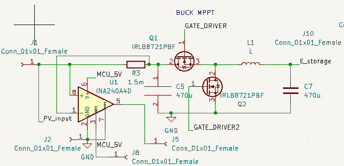

# 03/12/2022 - TA Meeting and Group Planning 
Due to several of our team members having interviews, we met on the first Saturday of Spring Break for our weekly TA meeting. We mainly discussed how to move forward ordering parts and ordering the PCB on our own. We ran into issues with the cost of our board being $133 for 5 copies, which caused us to miss the first PCB deaadline. Since the 3/8 deadline, we have audited the MCU board and placed an order ourselves to make sure it will arrive in time to test and debug. The biggest concern moving forward is finalizing the power board before the second deadline, and making sure all of our parts can be ordered as soon as possible. 

# 03/18/2022 - Research for USB-A Charging  

I have been using some of my freetime ovre spring break to understand how the USB-A Charging protocol will be implemented. 
At first we all thought that it would be controlled through the MCU, due to standard USB-A protocol also containing birediectional data ports. The following image is from 
["The Basics of USB Battery Charging"](https://www.maximintegrated.com/en/design/technical-documents/tutorials/4/4803.html "THE BASICS OF USB BATTERY CHARGING"), which shows the four input ports for typical USB communication. 

For our project, we do not want to send any data to the USB device connected as a load, which allows us to eliminate the need for both of the data lines D+ and D-. This can be done by connecting the D+ and D- lines together via a resistor. The resistance must be R $\leq 200 \ \Omega$, and this mode is referred to as a Designated Charging Port (DCP). A clear illustration of this is given Figure 10 of the [TPS2514 DATASHEET](https://www.ti.com/lit/ds/symlink/tps2513.pdf?ts=1647718862163&ref_url=https%253A%252F%252Fwww.ti.com%252Fproduct%252FTPS2513 "TPS2514 DATASHEET"). 

This allows the device to bypass the USB communication protocol, and directly connect to the internal battery. We can further ensure that the external USB device is recieving the correct power, by manipulating the voltage potential on either of the D- or D+ lines. The Divider 2 charging scheme is used for
10-W adapters, and applies 2.7 V on the D+ line and 2 V is applied on the D– line, as show below. Fortunately, the TPS2513 is in stock on [Digikey](https://www.digikey.com/en/products/detail/texas-instruments/TPS2513ADBVR/4494483#mktPlaceViewSection "Digikey"), and configures these two lines for us. This drastically simplifies the amount of work required to configure the USB port, where the TPS2513 automatically detects the power requirement of the input usb port. This further matches the simple Female USB connectors available [here](https://www.digikey.com/en/products/detail/sparkfun-electronics/BOB-12700/5762450?utm_adgroup=Adapter%2C%20Breakout%20Boards&utm_source=google&utm_medium=cpc&utm_campaign=Shopping_Product_Prototyping%2C%20Fabrication%20Products&utm_term=&utm_content=Adapter%2C%20Breakout%20Boards&gclid=CjwKCAjw_tWRBhAwEiwALxFPobpQSucNdZ-V3F0eN1F23PQx7BZaxLHDijavc5yAr-V-B6fmEHjo6BoCjKIQAvD_BwE "here").

If this does not work, there is also the option of buying a premade board to do this for us, and simply interface [this board](https://www.seeedstudio.com/Lipo-Rider-Plus-p-4204.html?gclid=CjwKCAjw_tWRBhAwEiwALxFPoR--l6bB3jGPfZKoGkSbGB3EaNlgAs9KFKoq4bSAiMn4nbsBqeK3YBoCO0kQAvD_BwE "this board") with MPPT. 

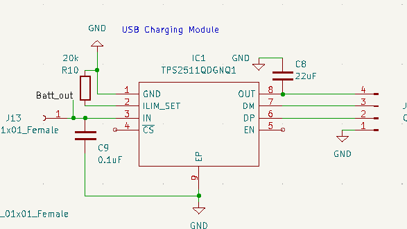

# 03/25/2022 - TA meeting and Team Meeting  

The first round of parts being ordered were delivered this week, but we have not recieved our MCU board to begin assembly and testing. This board is scheduled to arrive over the weekend, right before the second PCB order deadline. The focus of the TA meeting (3:45 PM) was to ensure we were designing our PCBs according to course standards, similar to the material covered during the PCB design review. With the second deadline being shortly after spring break, and our team being behind for several personal reasons, we talked about each aspect of the power PCB board that were not finalized. This included, the placement of current sensors, discussion of replacement parts, clearance for heat sinks, and USB charging safety. Although we have schematics for these designed in the KiCad schematic editor, we have not been able to simulate the MPPT fucntionality, which made us fall behind in the PCB routing and external connections. 

After a few hours of independent work, we also had a team meeting at 8 PM to discuss what each team member could focus on. Wonjoon would focus on the MCU code and assembly of the MCU board once it is delivered, whereas Yei and I will do all we can to make sure the power board PCB will not have to be ordered a second time. We further discussed the lack of components in stock on major carriers like digikey, suggesting to use breakout boards for safe USB charging and UART conversion. This is the easiest way for us to proceed in the project, without having extra safety concerns when testing. 

# 03/27/2022 - Worked with Kanin to finish Schematics  

With the second order PCB deadline around the corner, Kanin and I have been developing different parts of our PCB part. Previously, we were working in different KiCad Schematics, each downloading the ECAD file from Mouser as we each selected different parts. I had looked over the parts needed for the USB 10 W charging subsytem, as well as the current sensor ICs which had signals that needed to be routed to the MCU board. Today, we met up at ECEB to generate a bill of materials for the parts we needed to order and incorporated all of our schematics into a single KiCad Project. This was a tedious process, and involved both o fus scrolling through Mouser and Digikey to find the necessary model files and importing them to KiCad through the Library Loader application. we chose to move the USB charging module and closed loop feedback units into Kanin's working project, because he would take charge of the routing. The final implementation for version 1 can be seen below, which has been delayed due to a lack of supply and our team being behind on the project. 

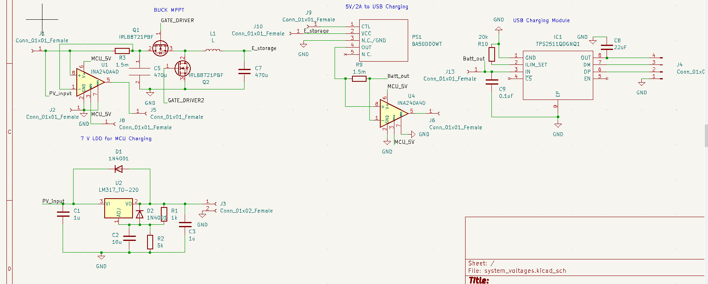

# 03/28/2022 - Routing and Ordering parts 
After all of the parts were in a skingle KiCad Project, we could begind defining the outline of th epower board as well as the different layers. We chose to use a 2 layer board for this application, because the large power traces must have certain amount of  clearance. We are estimating the maximum current to be around 4 A as a worst case scenario, so our power traces are mostly between 70-100 mils. Kanin finished most of the routing on his own, but we were both on a zoom call as I tried to help give ideas and look at trace clearance. When Kanin and I were ot working on the KiCad file together, I was finalizing the bill of materials. THe INA240 Current Sensors that are used in PWM systems only had 10 in stock on Mouser, so i quickly purchased them on my own. This allowed us to ensure the part would be in stocl, due to it taking a few days for orders to be processed through myECE. Kanin later palced this order, after this board was approved for the second round audit. 

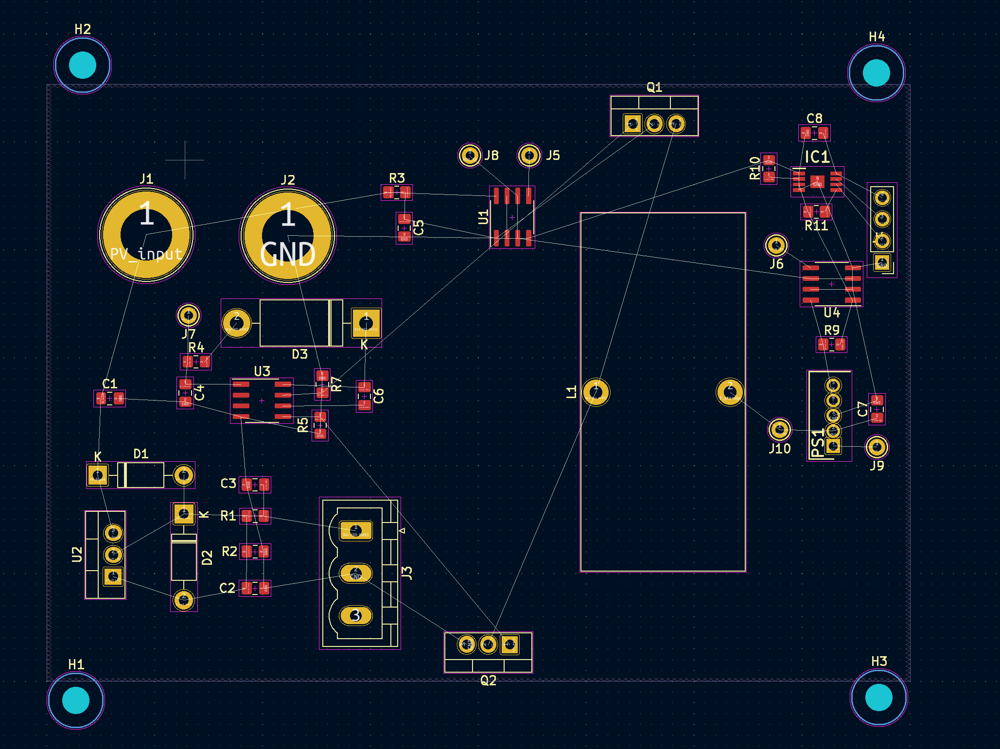
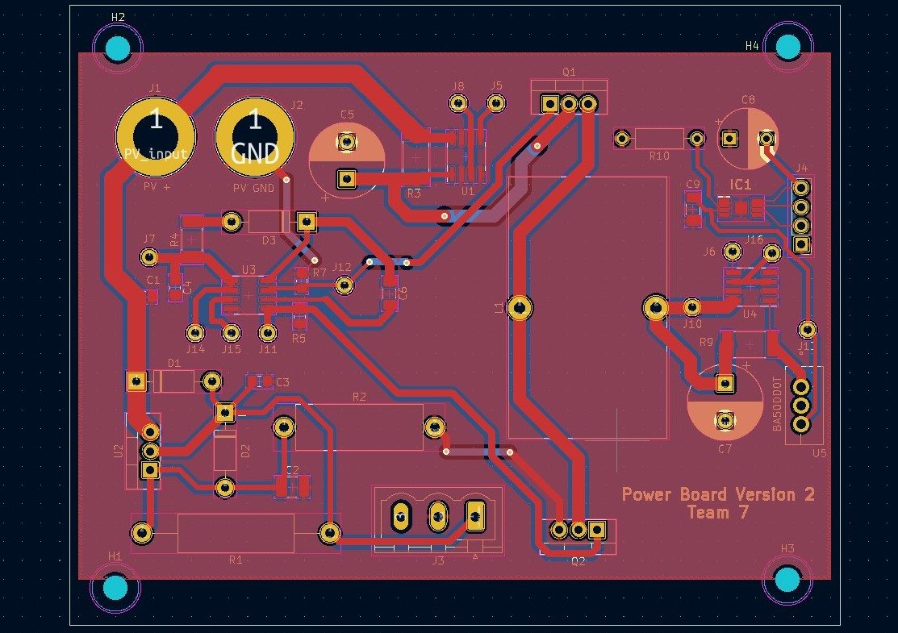

# 04/02/2022 - Panic About Shipping delay + MCU programming 
After the second PCB round order, all of our team spent some time working on the individual progress report and then focused on other classes. The PCB for our MCU arrive on 3/31, and all of the parts had been delievred to the senior design lab. We wanted to begin building this board right away, but the MCU board was delivered to Wonjoon while he was in quarantine for COVID. What makes this situation worse is that DHL, the shipping company for Version 2 of the Power board PCB, has an expected arrival date of 4/22. We paid expedited shipping on both baords, but DHL has had extremely long shipping delays for us. I do not know if this is because some of our PCBs were ordered through JLC, but this happened for both of our orders. We will contact the shipping company once our package is in the United States, hopefully it will arrive on time. 

I have begun looking into the MCU programming, specifically, how we can assign values to each of the different hardware pins and how each signal will be extened over each board. Wonjoon has sent a few articles over about how we will program the Atmega328P using the Arduino IDE. We are essentially using a development board that has a UART IC on it, because there are no more parts available online.  

# 04/07/2022 - Power Board PCB Arrives 
Fortunately, the power board PCB made it to the U.S. faster then anticiapted, and we were able to contact DHL for our package. The power baord was delivered to Kanin this afternoon, I had recieved a shipment from Mouser yesterday, and we had our previous part orders sitting in our locker in the senior design lab. We are now trying to get into the lab as soon as possible, to begin assembling the power board. Our plan is to solder the small ICs and SMD components under the microscope first, and then I can complete any larger components at home with my personal soldering iron. 

Furthermore, Wonjoon is out of quarantine and has been assembling the MCU PCB. We are trying to coordinate when we can both be in the lab to test the MCU for programmability, and to test the ATMEGA328P duty cycle signals. He performed all of the soldering after he acquired our first large order of components and has not ran into any issue. He told me that he has only been able to test the power traces of the MCU board, because we were unable to order the necessary UART ICs to program the ATMEGA328. When we met in lab today, we discussed ther possibility of using an over the shelf programmer with the connections available on the PCB. We tried to use one today for a quick test, but the programmer would not be recognized by either Wonjoon's or my own laptop.

# 04/11/2022 - Soldering of the power board 
Kanin recieved our version 2 of the Power PCB this week, which he ordered independtly from the course, but our components from  Digikey and Mouser did not arrive until 4/9/2022. Kanin began soldering, the power board PCB, but today was the first day we both went into lab to assemble the board. I brought with me the INA240 current sensors, which I ordered myself due to theri price. These sensors cost about $5 per IC, and we needed to order at least 4 in case one does not work. I also brought in 1N4001 diodes, jumper wires, PCB testpoints, Banana Connectors, and PCB mounting screws, which were the final parts we could assemble for the time being. We are still missing a 1N4002 Diode and the Pheonix connectors, which will be used for power and control/feedback signals that must be routed using jumper wires between our PCBs. Kanin has been in charge of ordering parts andd keep tracking of our Bill of materials, and informed me that the order has been processed by the department and should be en route soon. 

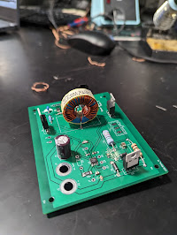

# 04/13/2022 - Picked up all parts from Kanin 
Unfortunately, Kanin tested positive for COVID today and we had to cancel our plans to meet together in the lab. I have picked up all of the pieces of our project that Kanin kept with him, becasue they did not fit in our locker, but I cannot go into lab myself. I chose to not go into lab today, because Kanin and I were both working with the same microscope last night and I do not want expose other students in the lab if I also test positive. Kanin and I then sat down on a zoom call and discussed how we should proceed with testing. We decided that I would begin testing the internal power management subsytem, which consist of an LDO used to power the MCU board and all internal ICs. If this wer to be functional, I could further attatch wires to specific testpoints connected to our TPS chip to ensure the USB port would be acting as a dedicated charging port. This involves connecting the poer supply directly to the input of the IC, and probing each output pin. If the chip is working, we should read 5V on Vdd, 2.7V on D-, 2V on D+, and 0V at GND. I asked Kanin if he could research the exact syntax and register mapping of the ATMEGA328 to generate PWM signals, but I also told him to rest up and focus on his health. 

# 04/14/2022 - Testing the Internal Power Supply and Power Management 
Today I performed some very simple testing of our power management, with different input voltages. I used the bench power supply in lab, that can reach up to 25 V at 1A. There were no inputs connected to our gatedriver, where the Buck Converter cannot deliver any power to the load if no switching signal is applied to the FETs. Thus allowed me to isolate the internal power manegement, because current could only flow through the LDO. The first test I performed was a continuity test for each component according to the schematic. Everthing was properly soldered and none of the components were floating, so I began testing the output voltage that would be sent to the MCU. I began doing incremental steps for $V_{IN}$, increasing by 500 mV and observing the outputvoltage/current draw. I quickly noticed that the measurements did not make any sense. Each pin of the LDO was at a random voltage value, and then output was not adjusting the output voltage to be within 7-8V. I then went to our github repository to find the exact part. The datasheet showed me that the LDO was soldered on in the reverse orientation, which I had to resolder and fix right away. I tried to test immediately after, but was unable to get clean/meaningful measurements at low voltages. I did not solve this issue, because I wanted to ask Wonjoon for more circuit theory about LDO operating conditions. 

# 04/15/2022 - Final small connectors and parts for boards + Soldering  
Today, I went to the ECEB supply shop to look for a few small and minor parts of our board that we did not have. Most of these components were simple connectors that make the project look more developed, but I also pirchased a 1N4002 Diode for the bootstrap circuit attatched to the high side gate drivers. I then went home and soldered these final pieces on to power board. I believe there are a few test points and jumper wries that need to be soldered or removed, but those can be done once we finish testing and begin integrating both PCBs into an integrated product.

# 04/18/2022 - Testing in the lab   
Due to several issues I ran into while testing the pwoer board last time I was in the lab, I did not have a chance to fully debug the output. Today I went into lab with Kanin, which was his first day out of quarantine, to fully test each aspect of the power board. We quickly solved the issue I has with the internal power supply management given werid results; one of our LDOs was siodlered on in the reverse orientation. After we removed this part and put a new component on, the pwoer supply was able to output 7-8 V consistently as expected. This allowed us to begin testing the ICs and synchrnous buck converter, becasue we could verify that each component was outputting the correct signals and waveforms. 

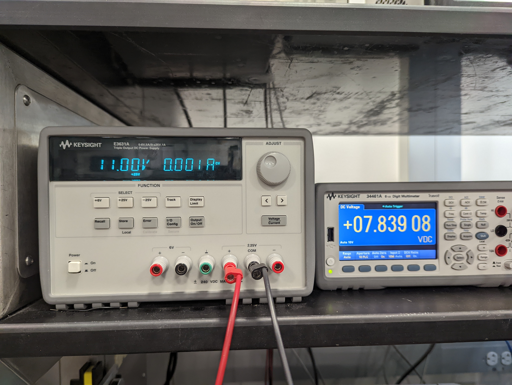

 This was done by using the waveform generator avvailable in lab, where we set it to high z mode, and then enabled inverted tracking between channel 1 and 2. This produces two complimentary PWM signals that will then be used as the input to the gate drivers for the two MOSFETs. Kanin also informed me today, that the gate driver must be powered at 5-7 V, but there is no internal power trace routed to this pin. Hence, the testing I perfomed on 4/14 for the synchronous buck converter, was meaningless because the gate driver was not powered. We quickly soldered this pin to our itnernal power supply traces, however, our power supply can only output this voltage if $V_{IN} > V_{Gate Driver}$. This means that we can only use a the DC power supply to test the buck at operating voltages greater then 7 V, otherwise the the synchronous Buck converter is not active in the circuit. This may cause a problem in the future, when we begin testing with a solar panel, but for now the synchronous Buck converter is working to regulate 5V at thae output. There are some unexpected voltages at the output of the synchronous buck converter, that we were unable to understand.

# 04/19/2022 - Working late in the Senior Design Lab  

I was unable to work on the project early in the day, because I broke my wrist this afternoon. I arrived at lab around 9PM, where Wonjoon and Kanin had already began testing. kanin and Wonjoon were able to see the missing connection on the gatedriver, and we ran a full set of tests to make sure it was working correctly. As we were going through various duty cycles, and changing the gain of our power eelctronic converter, we noticed that the output would plateau around 5 V. This would happen no matter ehat was the issue. I wanted to help perform continuity tests and probe the PCB with the oscilloscope, but I am in a lot of pain with my wrist as of the moment. Thankfully, Kanin has been helping me out and taking the lead. 

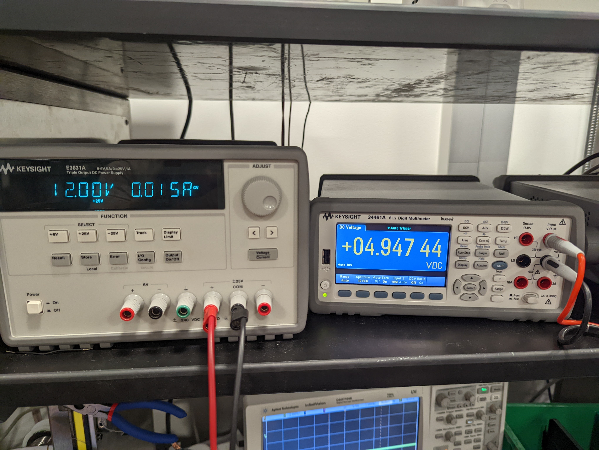

# 04/20/2022 - Helping Kanin Debug the Power PCB and begin building the PCB enclosure

Today I went into lab and helped Kanin further debug the synchronous Buck converter. The synchronous buck converter would not behave like the relationship $V_{OUT} = D V_{IN}$, which is essentially the entire reason we chose to use a linear step down converter for our MPPT topology. Today, we assemvbled the buck on the bread board to see if it was an issue with the sizing of our components. This also allows us to remove a single part from the design, and then observe the change in the output. We tried replacing the electrolytic capcaitors with ceramic capacitors, using new FETS, increasing our switching frequency, increasing the amplitude of the duty cycle, but nothing worked. We tried rebuilding the buck converter and using the elctronic load to strictly control the output voltage, but even with the electronic load, the voltage reached a plateau. We were able to get the buck converter to work up until 8V this time, but then it would exhibit the same nonlinear behaviour. I believe this is a Discontinous conduction mode problem, because we are not sourcing large current from the power supply. The only way to verify this is using a current probe, but we cannot probe the inductor current when it is mounted on the PCB. Kanin has a spare large inductor at home that he used in another project, so we will be testing for DCM tomorrow with this. Wonjoon was also in lab debuggin the NiCd charging, which I helped look over the PCB and reccomend a few solutions. I am not much of a help building and testing the components, due to my broken wrist. I ended up leaving lab early to go begin the PCB enclosure, which for now is just a wooden box that needs to be cut to shape. After I went home, I outlined all of the cut outs that need to be made. 

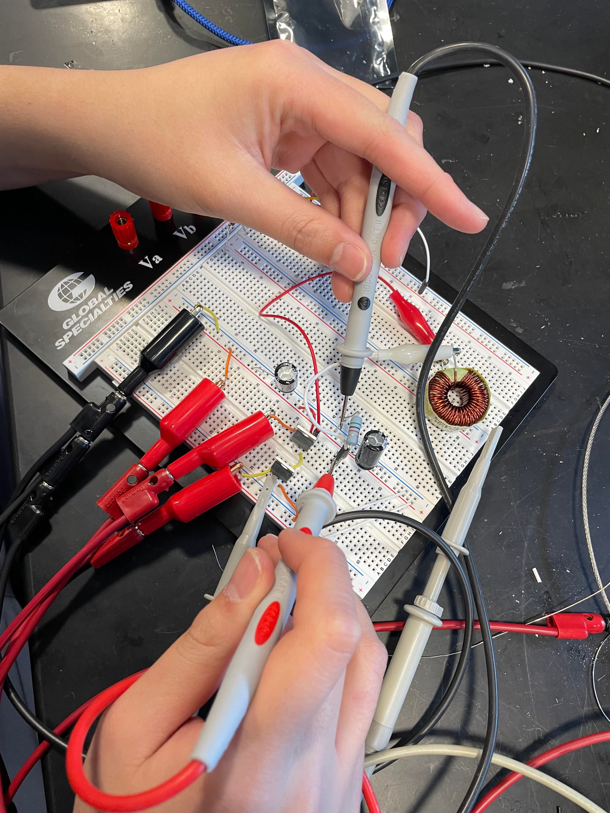

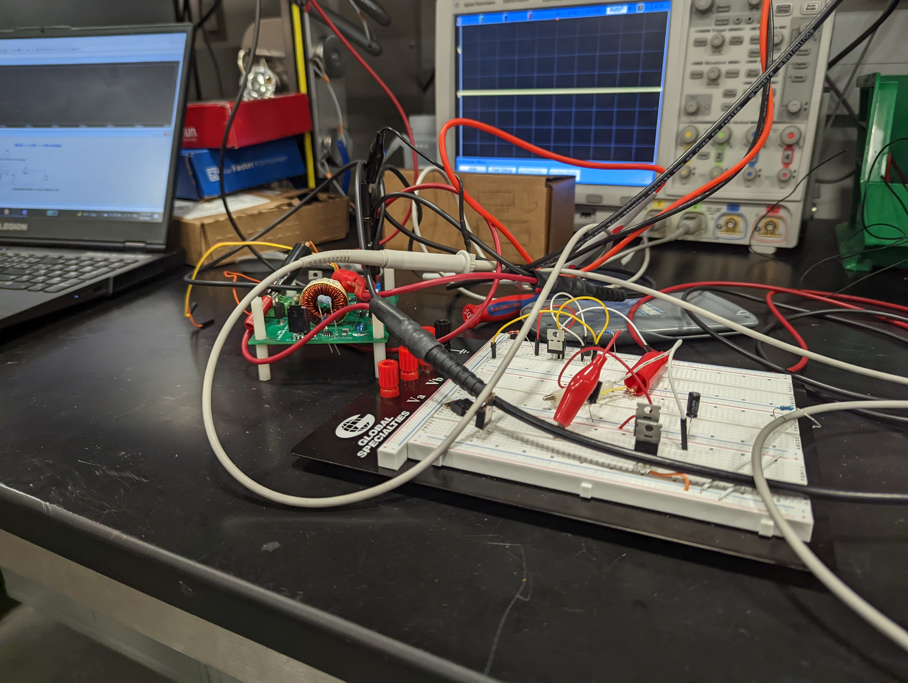

# 04/20/2022 & 04/21/2022 - Debugging the NiCD Charging current 

Yesterday, Wonjoon was debugging the control logic for constant 70 mA charging. I tired helping him yesterday by looking over his scheamtic but we could not find any issue. Today, we continued looking for a solution and tried to reaplce the diode that is supposed to be conducting when charging is enabled. We tried a zener diode, and a 1N4002 I had purchased, but could still not get a working output. At one point while we were debugging this system, I used the reeset button on the MCU board and noticed that the charging was enabled when the device was reset. I then pressed the reset button down, and we immediatelty were able to read 70 mA on the DMM. The problem was that the firmware set the erset signal to active lwo instead of active high, meaning the board was constantly being reset to the inital state. Once this was fixed in firmware, the NiCd battery charign schema was fully testaed anf fully verified. There was no further issues with the power board, which allowed me to fully commit my time to debug the power board. 

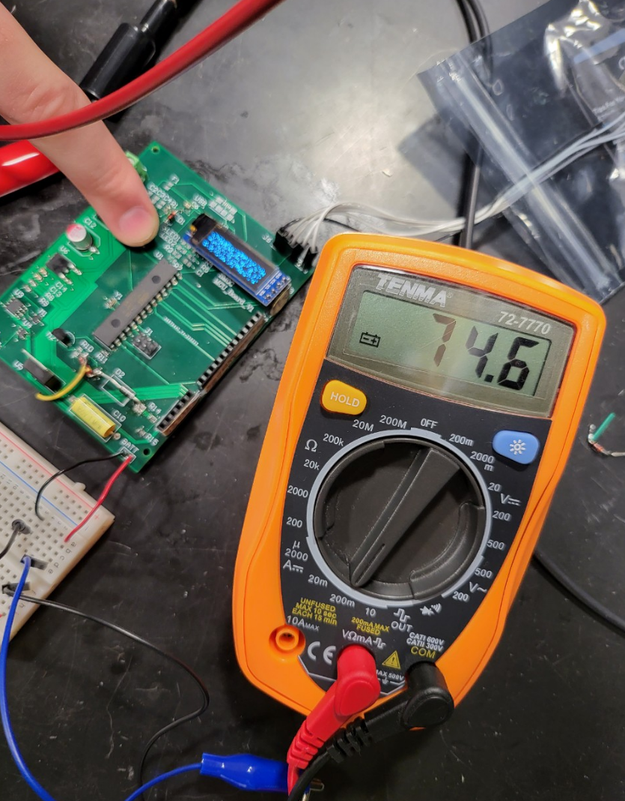

# 04/21/2022 - DCM and CCM issue w/ new inductor 

After Kanin was able to retrieve a new inductor, this on being 300 mH instead of 100 $\mu H$. I am quite sure this a DCM issue, becasue we have been testing at a slightly lower frequency then waht we designed the project around. We have been doing tests at different frequencies between 50-150 kHz, but our system was designed to operate at 100 kHz. The switching frequency can be a problem for DCM, but the equation for CCM is also dependendent on Vout and R. 

$$L_{CCM} = D \frac{(V_i - V_O)R}{2 f V_O} $$

After we tried using this oversized inductor, it did not improve the non-linear effects in the output at all. As a last ditch effort to try and figure this out before the mock demo tomorrow, we used the resistor box located at the Power Benches in lab. This device lets us set a known resistance at the output, which is capable of dissipating large amounts of power. Even when there was a power resistor attatched to the laod, the buck converter would not behave linear if the input voltage was greater then 4 V. We thought this might be an issue with our design, but I believe it copuld be due to EMI. We have a loops on our PCB that enclose large amounts of area, which could be causing magnetic intereference with our gate driver signals. We have probed almost each node in the synchronous buck converter schematic, but cannot identify the issue. 

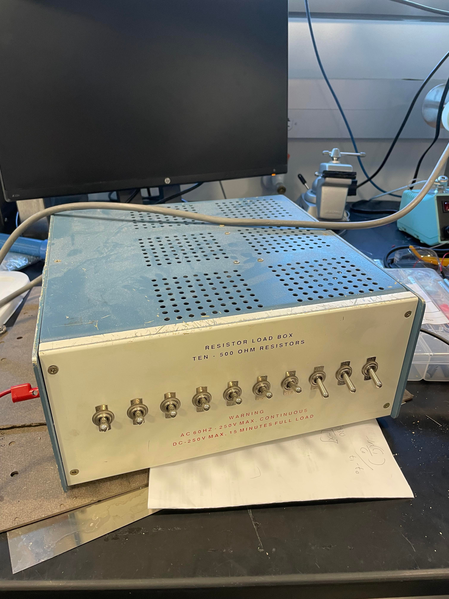

# 04/22/2022 - Mock Demo and Final Efforts to Debug the Synchronous Buck Converter 

We performed the mock demo on the breadboard, but then showed how the synchronous buck converter did not work. The power board PCB was entirely dependent on the correct operation of the synchronous buck converter, as discussed in the tolerance analysis of the Design document. We were fortunate enough to demo all of the functionalty on the MCU board, but our project had not been integrated yet and an entire subsytem was not working (The solar panel and MPPt algorithm are dependent on the linear gain of the buck $(\frac{V_{OUT}}{V_{IN}} = D)$. I found an article that supports EMI being our issue, [here](https://resources.altium.com/p/create-high-current-buck-voltage-controller  "here"), which led Kanin to suggest building the Buck converter on a perfboard to try and minimize the enclosed area in our system. I told him to go for it, but my hand is now in a cast and I am unable to help solder or assembly anything. He was able to assemble and test the perfboard implementation, but it seems that the problem could be an issue with our design, because the Buck converter is nonlinear on the PCB, breadboard, and the perfboard.  

# 04/24/2022 - Final Development of MCU code + Finish PCB Enclosure 

As a team, we have decided to stop focusing our attention on the synchronous buck converter and begin integrating each subsystem together.  We do not want to solely focus on one subsytenm not working, and then have a messy project that is not fully integrated into a single device. Today, Wonjoon and I sat down and integrated two different pieces of firmware. He had developed the logic for NiCd battery management, and I devleoped the firmware for MPPT and controlling the buck converter. We have not been able to test with the solar panel, due to cloudy rainy weather this week. We decided that we should not demo our MPPT algorithm, because it had not been tested and could create issues during the live demonstration. Thus, I had to rewrite and design some firmware to control 5 V USB charging from the USB poer supply. This was not an extensive change, but there was an issue with timerOne. TimerOne is the 16 bit clock on the ATMEGA328P that I used to design a 100 Khz complimentary PWM waveform. Wonjoon informed me today that he was also using TimerOne for the NiCd battery management, meaning I had to change my implmentation to work with the 8 bit clock using timer0. This also meant that we could only run the PWM signals at 62 KHz, due to the internal PWM register configuration inside the ATMEGA. This took about two hours to solve, before we were able to get the MCU to output the PWM signals and have the NiCd firmware programmed at the same time. We quickly performed tests to make sure the MCU PWM signals were still outputting 5 V for USB charging, and then I went home to finish the PCB enclosure. 

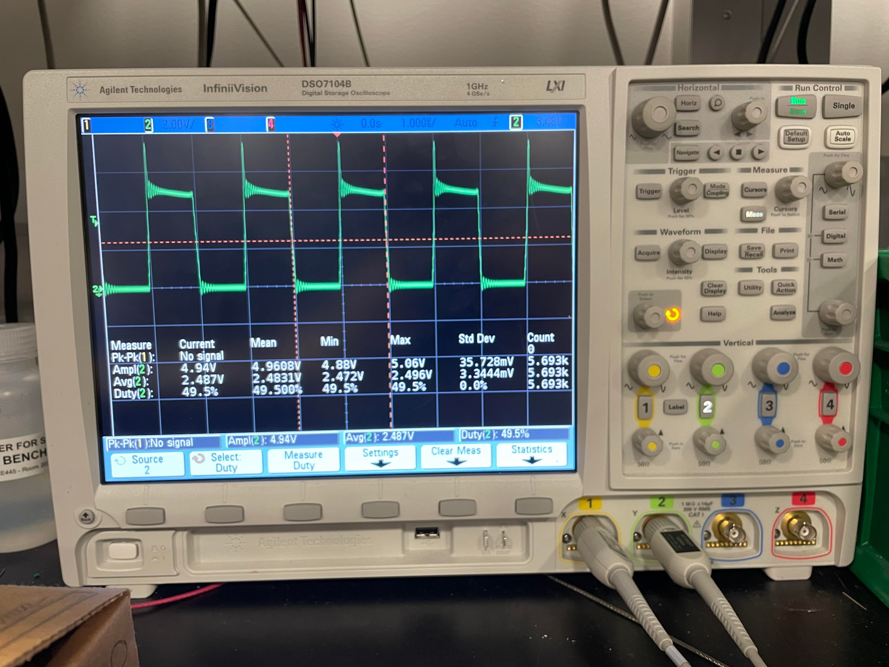

The final steps of the PCB enclosure included cutting out the correct dimensions for all of the components, applying foam inside such that the PCB would not get damaged, and applying a layer of paint to give it a professional finish. My roommate helped me out with the woodworking, because my wrist is still in a cast, which I greatly appreciated. After the enclosure was finished, I attached the PCB moutning screws on the inside, and was able to verify that each PCB was secure and in the correct orientation. 

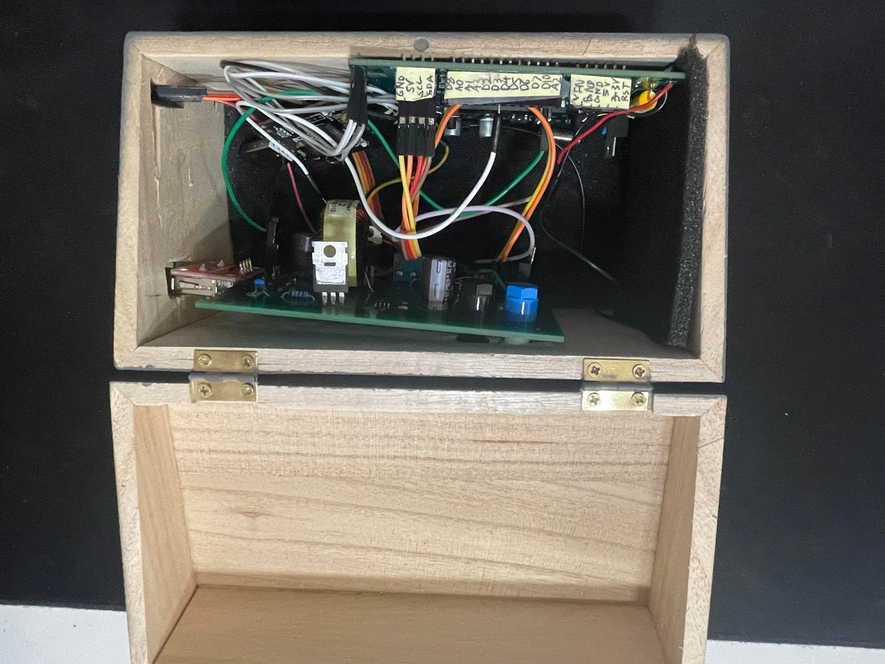 

# 04/25/2022 Final System Integration + Drafting the Handout for the Demo 
The very last tests performed were done as a group. We all went into lab, with the fully integrated device inside the PCB enclosure, and began rehearsing for the demo. We went through each R&V and were able to achieve almost all of them. The only R&Vs we did nto achieve, were MPPT and 2A  and 10 W charging speeds for the USB port. These can be directly attributed to the buck converter behaving nonlinearly, but as you can see from the gif in Yei's notebook, our power electronics were able to chareg a USB device still. I also would like to mention that I did the entire handout for the demo alone, using a template I use for other assignments in latex. Our final demonstration is tomorrow, and we feel that it will be very successful. 

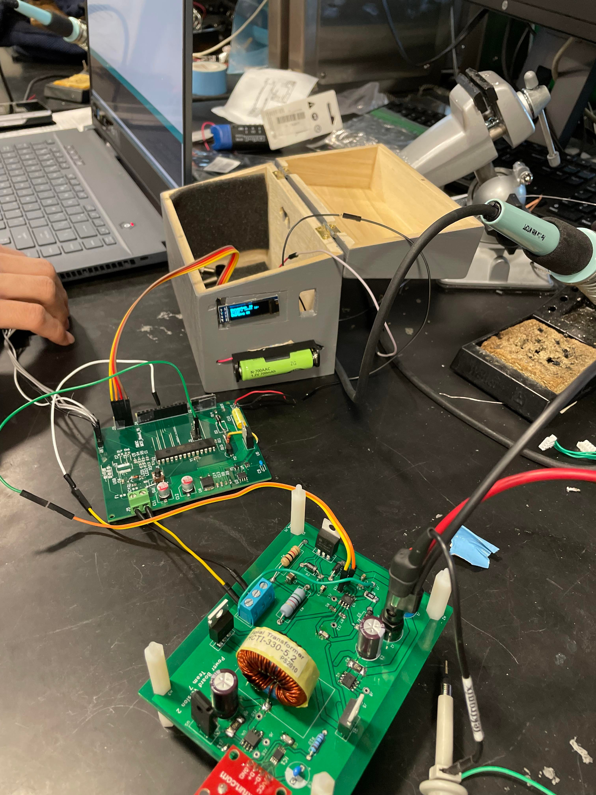

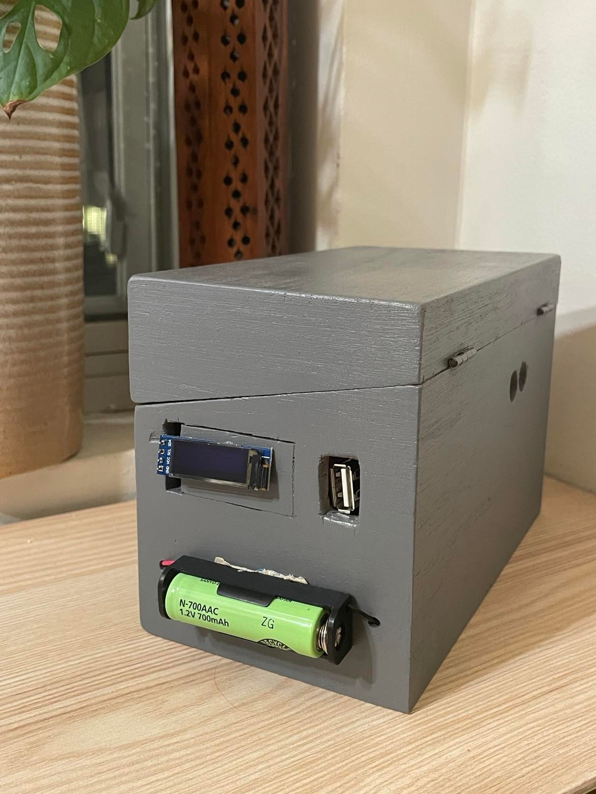

# 05/01/2022 Final Data Collected for Presentation and Report

We recieved some good feedback from the mock presentation on Friday 4/29, which manily was centered around the format and flow of our presentation. There were not a lot of issues with our presentation skills, but the audience felt distattched from the presentation because the order did not make sense. Today, I changed the order of the presentation to show the final results of our project at the beginning. This gave our audence soenmthing tangible to understand about our project at the start of the presentation. The second thing I did, was go into lab and be able to obtain some tables and plots for our final presentation. We realized that we had no pictures in the presentation that comunicated the issue and problems we encountered during the project, so I collected data and wrote a python scipt in 445plots.ipynb in this repository. The plot below demonstrates the nonlinear beahviour of the synchronous buck converter, which proved to be detrimental to our project. We do not need to present until Tuesday morning, which gives out team ample time to prepare and rehearse. 

As for the final report, I have already created and shared the overleaf document with everyone on my team. I have been slowly working on doing tables in the appendix, since the formatting can be unclear in latex. I am using the course template of course, so it is going much faster then it would on my own. At this moment, I have most of our pictures in the appendix, Requirement and Verification tables, the bibliography file started, and a little but of section 2 started. 

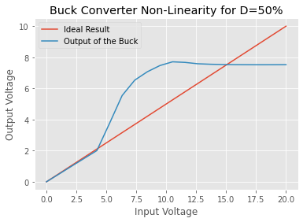
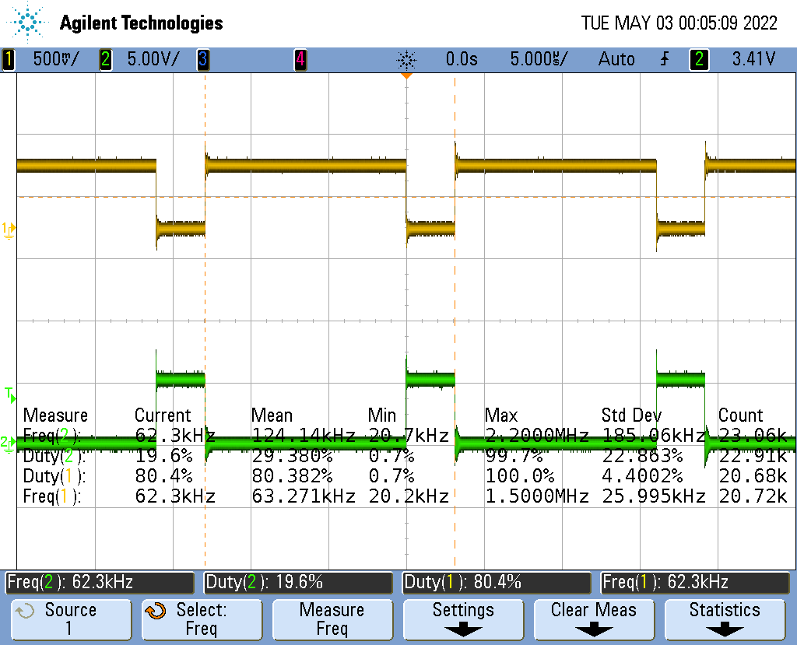
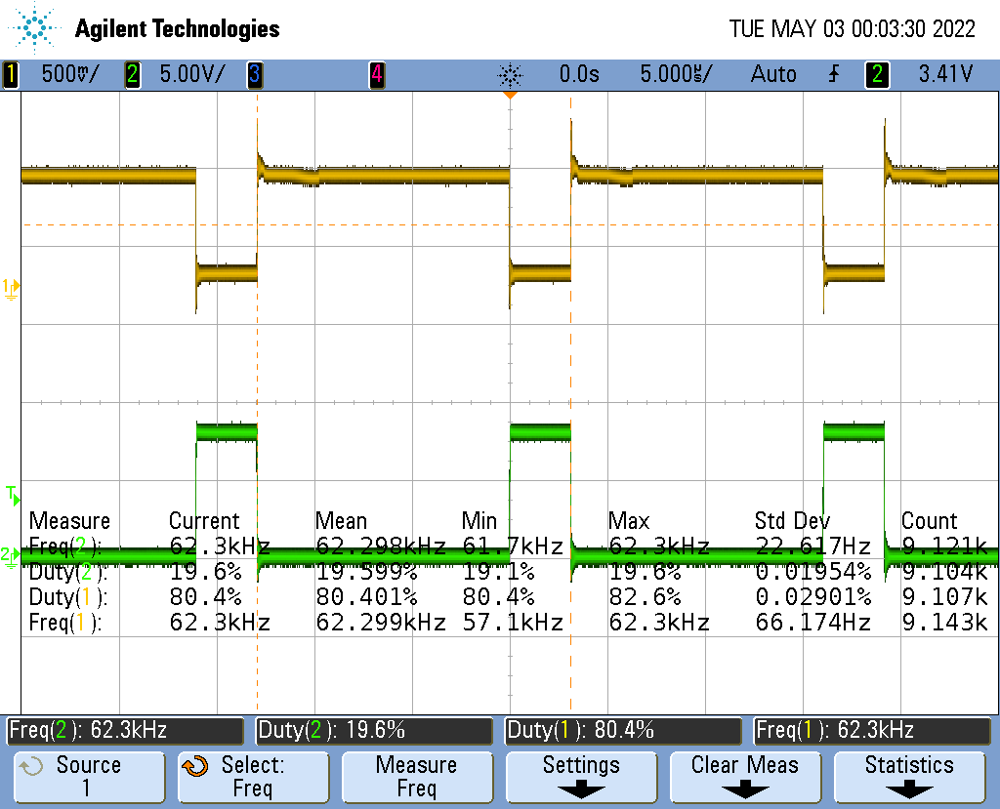

# 05/03/2022 Final Presentation

We have successfully completed our project and presented today. Heres a picture for fun

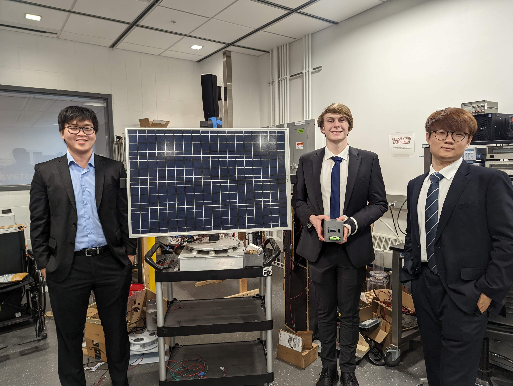