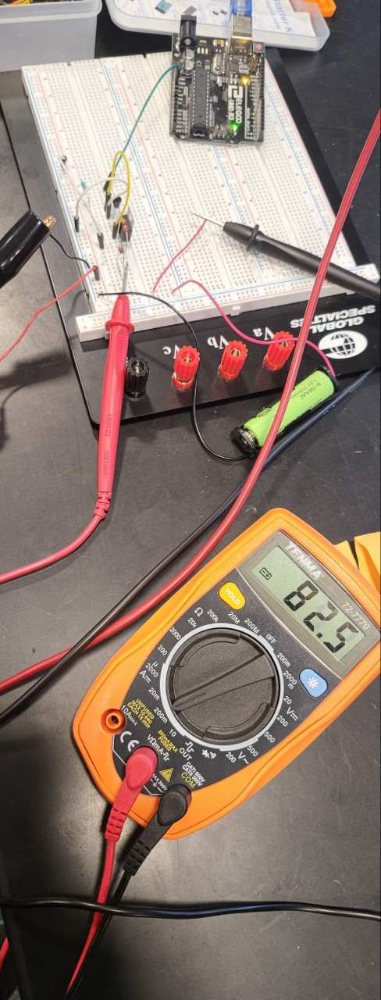

# Table of Contents
* [references](#references)
* [First TA Meeting](#Firstmeeting)
* [MCU Board Design Progress 1](#MCUProgress1)
* [MCU Board Design Progress 2](#MCUProgress2)
* [MCU Board Design Progress 3](#MCUProgress3)
* [MCU Board Routing Phase 1](#MCURouting1)
* [MCU Board Routing Phase 2](#MCURouting2)
* [Component Ordering Last Minute Edits of the Version 1](#Order1) 
* [I2C Display Code Progress 1](#Code1)
* [Power Board PCB Finalization](#PBF)
* [MCU Board Assembly Day 1](#Assembly1)
* [MCU Board Assembly Day 2](#Assembly2)
* [MCU Board Test Day 1](#Test1)
* [MCU Board Test Day 2](#Test2)
* [MCU Board Test Day 3](#Test3)
* [MCU Board Test Day 4](#Test4)
* [MCU Board Test Day 5](#Test5)
* [MCU Board Test Day 6](#Test6)
* [Battery Charging Test Day 1](#Batt1)
* [Battery Charging Test Day 2](#Batt2)
* [Battery Charging Test Day 3](#Batt3)
* [Battery Charging Test Day 4](#Batt4)
* [MCU Final Result](#MCU_Final)

# references 
* https://ww1.microchip.com/downloads/en/DeviceDoc/ATmega48A-PA-88A-PA-168A-PA-328-P-DS-DS40002061B.pdf 
* https://learn.adafruit.com/adafruit-gfx-graphics-library

# 2022-02-08 to 2022-02-10  Project Proposal 
We had our first TA meeting Feb 8th to get our project proposal draft checked out. While the project proposal served to present general project idea to the TAs and the faculty, it helped us to sort out general design approaches and set priority goals. One concern we brought up to the TA during this phase was usage of the ECEB solar panel. Buying solar power that is small sized, but capable least 10W is quite expensive in the market. Since our project goal is to output 10W, having an access to ECEB solar panel (on the sunny days, using only small part of it can harvest around 80W) will be extremely beneficial. 

# 2021-02-16 MCU Board Research 
As indicated on the project proposal, potential microcontroller candidates are ATMEGA2560 and ATMEGA328. ATMEGA328 will be preferable if it can support all the peripherals we require. 

Lukas and I purchased DIP package of ATMEGA328 (with our own money). Comparing the DIP package and the SMD (TQFP), DIP lacks 4 pins (28 vs 32 pins) which are two ADCs (ADC6 and ADC7), one VCC pin and one GND pin. To get accurate represent of what our system requires, I created a chart below. 

 
__System IO Requirements__

Typically, display interface require a lot more data pins to be connected to it. However, it seems like using built-in I2C capable display will reduce the required number of the data pin to two. With this assumption, our system will roughly require around 10 data pins from the MCU. 

For the MCU specific functional requirements, 2 XTAL designated pins need to be reserved for the crystal oscillators, 3 data pins for the USB protocol interface and 1 pin for auto-reset needs to be reserved. Therefore, minimum data pin requirement for the MCU is 16 pins. 

ATMega328 is capable of total 23 I/O pins. This is enough quantity of I/O pins for our system from the rough analysis. Extra 7 pins are also available to encounter for the potential expansion and error on high level design phase. 

# 2021-02-18 MCU Board Design Progress 1 
Previously on my startup project, I used ATMega328P to design custom MCU board with USB protocol, Motor controller and UI interface capability. Since basics of the MCU board design doesn't changes, I based the design on my previous work. 

**Crystal Oscillator Selection**

Crystal oscillators are hard to find due to supply shortages recently. Challenge is to find capable crystal oscillator that will be able to support our desire clock frequency and also meet ATMega328 requirements. In this design, I will be using resonator rather than the oscillator due to power circuit's characteristic of being noisy. Although resonators may consume more energy, we want more robust and noise resilient clock source since the MCU will be used for duty cycle, MPPT, of the Buck-Boost circuit.

To match performance of the Arduino Boards (the maximum processing power reference we need), 16MHz resonator CSTNE16M0V51Z000R0 by Murata Electronics was selected. This resonator has a built in capacitive substrate so separate capacitors are not needed. 

# 2021-02-19 MCU Board Design Progress 2 

Today, all the necessary MCU level design plans were completed. Some major design plans to note are written below. Other than the design planning, basic schematics were completed. 

**USB to UART Design Plan**

To interface between ATMEGA328 and programming device, USB to UART converter device is needed. However, the problem is that almost all of these devices have long lead time and currently not available. Only chip available at this time point was FT231rl chip, which was chosen to be our USB to UART chip. In case this chip also goes out of stock, our backup plan is to create a connector space for USB data communication pins (TX,RX,DTR) and use over-the-shelf FT232 based interface board. 

**Power Circuit Planning** 

ATMEGA328 requires 5V and 500mA voltage and current supplies. This also should provide enough power to run necessary peripherals that needs to be powered from the MEGA (LCD display, current sensor etc). The main challenge in designing power circuit for the MCU board was managing 5V coming from the USB connection while debug / programming laptop is plugged in. We want the MCU board to be powered via internal power supply all the time. To shut off the plugged in USB from supplying the power while internal system is providing the power, comparator logic below was used.

 

From the schematic above, VIN comes from the internal power system. Because the comparator uses 3.3V and 5V to compare the input power, VIN port needs to be more than 6.6V for this logic to appropriately select VIN instead of USB's 5V supply. Thus, internal power system will provide 7V to MCU and MCU board has on-board 7V to 5V LDO to match the ATMEGA's specification. 

# 2021-02-20 MCU Board Design Progress 3 

All the necessary schematics were finished including the NiCd battery charging logic. In addition, all the components were chosen initially as Design Document deadline was approaching. 

**NiCd Battery Charging** 

NiCd Battery is our primary portable energy storage source where 1.2V output is available through this medium. Under some research, we decided that using Panasonic's 700mAh rechargeable battery is the best choice. To charge NiCd battery, supply constant current is the most important factor. This current rate needs to be 10% of the battery capacity (700mA * 0.1 = 70mA). To supply constant 70mA current to battery (or batteries), LM315 power management IC was chosen for its compact size and sufficient functionality. LM315 was configured to be operating in constant current output mode to achieve the constant 70mA charging. This way, as long as series battery connections are below 40V, LM315 can charge as many battery as possible at constant rate of 70mA. In addition, I wanted to add PWM control (and potentially control battery charging speed control based on the charge level) to shut off the battery charging depending on the battery charge rate. Overall circuitry was modeled using PSPICE (image below) to fine tune the charging current and PWM logic. 

 

In the simulation, it is possible to see square wave voltage source representing ATMEGA's PWM pin. As 5V control pin is set high, LM315 supplies 70mA to the load and as soon as 5V is shut off, no current is provided to the load. 

# 2021-03-05 MCU Board PCB Routing 1 

The board is a four layer board with top and bottom signal layers with ground and 5V layer sandwiched in between. This design was chosen due to lots of signals and also power conversion is being processed on the board. Four layer design not only makes the routing simpler but also isolates some noise sources (power signals) from the noise-sensitive signals.

As the deadline for the PCB board review approaches, I tried to finish up general outline of the PCB. The most challenging part about the routing was laying out power components and deciding the trace width. Especially for the LM317, heat generation is an issue. Although not too large of a trace width is required, to ensure heat dissipation, 2mm trace width was chosen considering the length of the trace. In addition, polygon pour was poured for additional heat dissipation.   

# 2021-03-06 MCU Board PCB Routing 2 

Due to the usage of lots of SMD components, via stitching was done. 

# 2021-03-12 Component Ordering Last Minute Edits of the Version 1 

Initial components were selected and order was placed. We realized that lots of components we originally intended to use on design document were out of stock so had to find replacements. Also, FT231 USB to UART chip is out of stock. Therefore, we decided to proceed with our back-up option of using over-the-self USB to UART board and interface with the connector. 

# 2021-03-20 I2C Display Code Progress 1 
 
 I2C display test code was written. To make this functional, Adafruit GFX Graphics library and SSD1306 library are used. Display will need to convey largely two information: Total Harvested Energy by using this device and Battery charge level. Today, battery charge level code was written along with general setup code to write custom messages. On the battery charge level display function, code to control the charging of battery was also written. 

# 2021-03-30 Power Board PCB Finalization  
 
 For the past 10 days, I had COVID and was under quarantine. After being hack, I helped Yei and Lukas finishing up the power board's PCB layout. Main thing I paid attention was effective component placement for heat dissipation. Because the power board need to be able to step down upto 22V to 5V (and 7V), there will a lot of heat dissipation through out the board. In addition, 2A trace and other relatively high amp traces exist on the board. Therefore, it was important to place components carefully considering the heat dissipation. To enhance the current trances, large polygon pour was implemented on both signal layers of the board. 
 
# 2021-04-02 MCU Board Assembly Day 1  

 The MCU board's PCB order arrived March 31th evening and today was the first day I went into the lab to assemble the board (parts arrived week before). Before soldering everything on to the board, labeling all the components with their dedicated component numbers (R1, C1, etc...) is an important step to make the assembly process more fluent. When I label the components, I was also able to find that two of the components, R10 and U6, will not work for the PCB. I immediately placed an alternative order after realizing this. 
 
 
 
 Like the picture above, all the SMD components (other than the ceramic resonator and U6) were soldered today. Ceramic resonator has smaller pad so I wanted to leave it for tomorrow and have it soldered with my TS100 soldering iron K1 tip to make sure that component pad is making a good connection according to how the datasheet describes ("hand soldered and 90% of the component pad must be making contact with the PCB pad"). Most connections looks genuine and was tested with multimeter continuity test after soldering. 
 
# 2021-04-03 MCU Board Assembly Day 2  

Today, every components other than U6 (ordered and not arrived yet) and J6 (over-the-shelf USB to UART conversion module) was soldered. Again, all the connections were tested with multimeter to make sure all the connections are genuine.  

There are some unsoldered pads on the top area of the PCB. These components are for the FT231 USB to UART chip which went out of stock until the end of the semester. Because we made alternative solution of using over-the-shelf board for this, pads are left unsoldered so that USB programming capability is unaffected and just solely controlled by the over-the-shelf board. 

It is also possible to note some bodge wires coming from U5 to R10 and switch connections. Switch polarity on the original trace were flipped so I used bodge wire to correct the connections during today's assembly process. U5 to R10 is the NiCd battery charging logic. Yesterday, I ordered new R10 SMD resistor but I attempted to not use R10 SMD pad and use existing equal spec through hole resistor. Bodge wire was used to connect LM317 (U5) output to one leg of R10 and the other leg was shorted to D2's pad. The leftover pad of R10 will not influence the signal here since via connecting one end of the R10 pad is from the U5 output and this functionality is being replaced by the bodge wire. The other pad is necessary to be connected to the rest of the components since this is connected with the ATMEGA328 battery charging control pin. 

# 2021-04-05 MCU Board Test Day 1  
The first thing that needs to be tested after the assembly is power logic. This logic is important since this not only relates to the battery charging, but also, power the MCU itself as well. The main input power to the MCU board is coming from the power board in the form of 7V. Although the MCU is operating with 5V, 7V is needed for the convenient USB debugging feature. This feature is not the most necessary function (being able to debug regardless of the power source) but is convenient for the developers. 

Inputted 7V goes to two paths: 5V step down logic to power the MCU and Battery Charging logic. U6 IC missing is the LDO that does the step down functionality but since it didn't arrive yet, was proto-boarded using the jumper wire (picture below).

However, 5V step down didn't work. One assumption behind this was that because the 5V output pad of U6 has a large surface area, simple wire connection will not be able to deliver proper power. Therefore, the board will be tested tomorrow when U6 arrives. 

# 2021-04-06 MCU Board Test Day 2  
U6 arrived today and was soldered in and I began testing the power logic again. The result was successful. I was able to get constant 5V stepped down reading throughout the MCU board. Because the PCB has dedicated power (5V) layer and ground layer, this means any components using 5V power source will be getting clean power. Picture of probing 5V test point on DMM is below. 

Since the main 5V power output is working, I tested 7V and 3.3V power traces as well. They all seemed to be outputting correct voltage in acceptable tolerance ranges. 

Other MCU operational logic such as reset and basic programming pins were wired and functioning correctly in terms of the continuity test. Therefore, the next step will be bootloading the ATMEGA328 and trying to upload test LED blinking program. 

# 2021-04-07 MCU Board Test Day 3  
Today, I was able to bootload the ATMEGA328P successfully using my Arduino UNO board as a ISP device. The arduino IDE seems to recognize the board environment well since when it was bootloaded successfully, settings were automatically set so to match MCU chip (ATMEGA328P) and the 16MHZ resonator installed on-board. 

However, I was not able to successfully load the program. Whenever I plug in the over-the-shelf FTDI chip to the computers, error message indicating corrupted USB device pops up. This not only popped up in my laptop but also in desktop in the lab and all of my partners' laptops. 

# 2021-04-09 MCU Board Test Day 4  
Trying to debug the over-the-shelf USB to UART board, I tried multiple different cables and tried to download various different FTDI chip drivers. It seems like this board need specifically 2.8.3 version of the driver. However, ver. 2.8.3 of the FTDI driver was not available anywhere. I decided that it will not be worth trying to debug over-the-shelf board and moved on after ordering new USB to UART board. 

# 2021-04-11 MCU Board Test Day 5  
The new USB to UART conversion board arrived and was soldered in to the redirected PCB traces. After it was plugged in, my laptop didn't throw any error messages and was able to upload the LED blinking program successfully (GIF below). Thus, MCU programming functionality is verified and working. 

# 2021-04-13 MCU Board Test Day 6  
Because our MPPT algorithm and other control signals for the power board needs to use PWM signals, it is necessary to classify PWM digital pins and non PWM digital pins. In addition, analog signals labeling was needed as well. Mapping reference was done using the Arduino UNO pin maps since some of our prototype testing code has been using Arduino UNO. 

In addition to labeling and mapping the pin maps on the software, display communication protocol was also initialized. For fluent SDA and SCL communication, Adafruit's GFX library was used for the I2C display communication. Library and custom display to ATMEGA control pin integration code was successfully uploaded. 

# 2021-04-16 Battery Charging Test Day 1  
To test out whether battery charging outputs correct voltage level according to the charging control pin (ATMEGA328P PB1), voltage level was monitored as this pin was set high or low. By measuring the voltage across multiple terminals and comparing the values with the simulation, circuit behavior was verified. For the most parts, voltage values were approximately 0.05V off compared that of the simulated results. However, I decided that this will be in a reasonable range of tolerance. 

Current across the load was not tested since the battery holder did not arrive yet. 

# 2021-04-18 Battery Charging Test Day 2  
Battery holder arrived and hooked up the battery to the board's charging logic. Behavior of the logic was weird. Initially, the charging current was 70mA exactly. However, after exactly 1 second, 70mA goes down to 0mA and current was no longer being outputted. Voltage values were checked again to see if the circuit is behaving correctly. However, due to the battery voltage on the load, verifying it with the simulation was not possible. In addition, switching noise was heard every time current drops to 70mA to 0mA on the DMM I was using. Suspecting it might be DMM issue (blown fuses or surge current), decided to test tomorrow with my hand-held multimeter and other lab's DMM. 

# 2021-04-20 Battery Charging Test Day 3  
Battery charging logic has been tested with my own hand-held multimeter and different lab's DMM. However, it seems like the battery charging circuit still outputs 70mA only for a second and goes back to 0mA. I decided to probe the circuit around and test by changing different factors like VIN voltage to LM317, load condition (short the charging logic to 0V) and putting a 500mA fuse across. None of these attempts worked. 

Thinking that it might be the PCB issue since some modification has been done on the PCB (cutting the wrong trace and redirecting it by wires, using same pad to mount through-hole resistor in place of SMD resistor), I decided to model the same circuit on the breadboard. Breadboard circuit behavior also was not idea. Although it was outputting around 70-82mA current, it was always outputting it regardless of the control signals. Voltage measures were the same as well. 

I decided to probe the PCB side again and noticed that after the signal go across the diode, voltage drops to 0V. This was odd since the diode should conduct current fully after 1.2V. However, even at 1.3V reading, it was not conducting the current and was 0V after the diode. Thinking that it might be the diode problem, I decided to swap out the diode on the breadboard and test it. When I swapped the diode, at a glance, it looked fine. There were still some non-ideal behaviors observed (forward voltage still not the expected value) but I decided to swap the diode out on the PCB and see how it performs. 

# 2021-04-21 Battery Charging Test Day 4  
Three diodes are prepared for candidates. Two are the rectifier diodes I was able to find with similar diode specifications (1V forward voltage) and another one was zener diode. Breadboard gave consistent results across all three alternative diodes so I just decided to start with higher power rating rectifier diodes.

However, none of the diodes worked on the PCB. Regardless of the diodes I used. They all seemed to output 70mA to 80mA range of current for the first couple seconds and goes back to the 0V state.  

I also tried to probe whether it was an issue with the battery. I ordered two batteries, trying to use one as a fully charged one and the other as a fully drained one. All the testing has been done with the drained out battery. I realized that the battery level somehow is around 1.05V. Testing began after draining this battery a bit more.  

After repeating to reproduce current going from 70mA to 0mA situation couple more times, I noticed that this timing corresponds to indicator LED's on and off cycle periods. I immediately try to press reset button of the MCU board and noticed that 70mA was being outputted. The problem was MCU initially setting the pin low and later setting it high as programmed. However, because the logic is active low, setting control pin high was keep turning off the logic. After realizing this, the code was fixed and 70mA are being outputted reliably whenever we want it to charge the battery. 

# 2021-04-25 MCU Code Finalization  
Final MCU code has been written and loaded to the MCU board for the full integration with the power board. The main challenge was uploading the gate driver PWM generation. Lukas and I attempted to write the code and debug it. There were lots of documentation about using PWM D9 and D10 pin (Arduino pin mapping), however, pin 9 was assigned for different function on the PCB trace level design. The challenge was getting the other PWM pair to do the same thing. Special type of PWM generation was needed since we needed around 5KHz fast pwm signal generation, which is not supported by the normal analogwrite and digitalwrite functions. We ended up using pin 3 and pin 11 PWM pairs. To test whether the valid PWM signals are being outputted, poth pins were observed via oscilloscope. Two pins seems to output exactly inverted PWM signal, which is a valid input going to the gate driver of the buck. 

Battery charging code logic was also editted and integrated with the whole system code. Again, voltage reading was read from (max 0 to 1V reading through the divider network) battery sense PCB trace and was scaled from 0 to 1024 for analogRead. Display code also was edited reflect the sensor feedback values.

Finally, the MCU board and power board was merged. The power board seemed to output about 7.8V to the MCU board. Since the 5V step down logic can handle up to 20V, this is more than acceptable range. The MCU board also seems to get sufficient about of power to operate the MCU itself, charge battery and the display. 

The final result of the integration is below via GIF image. Currently, the MCU code is driving the gate drivers with the PWM signal and buck is using this to charge the phone with 5V USB protocol. 

----------------------------------------------

